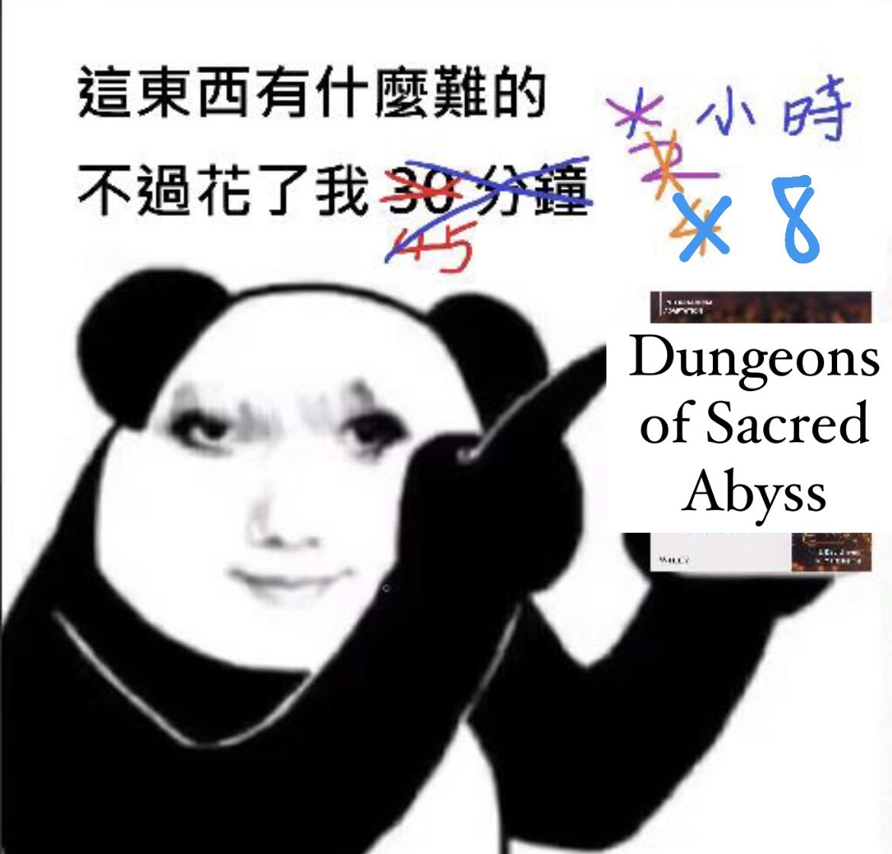
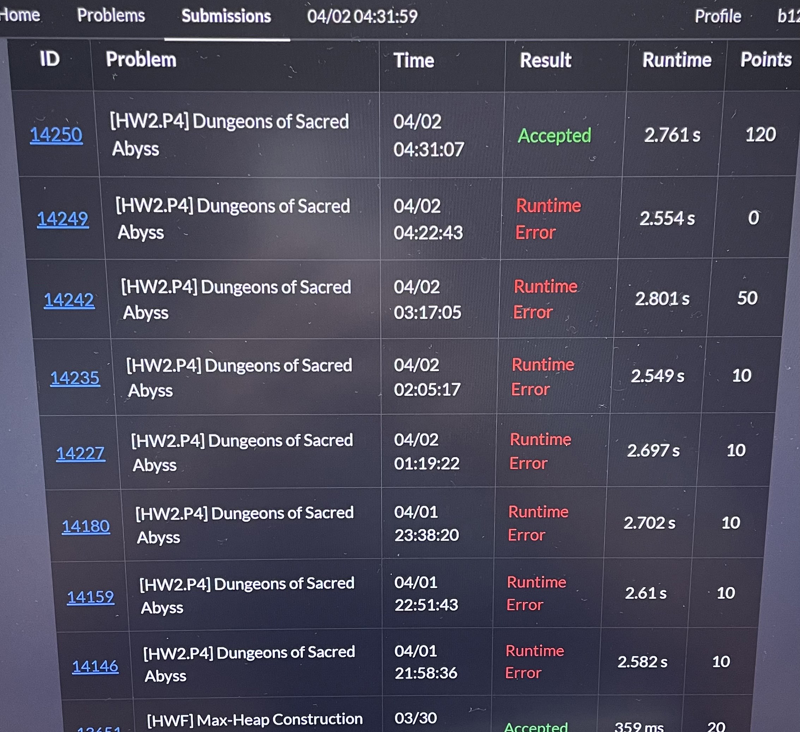
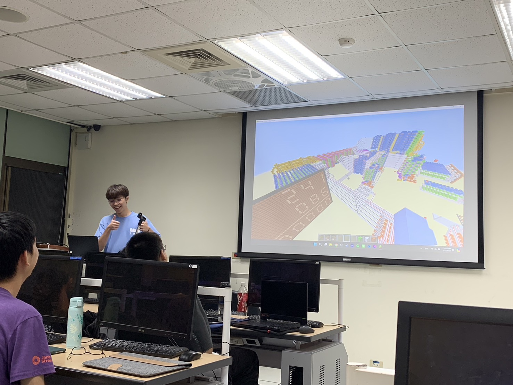

> 大一的時間都被我水掉了 QQ

## 序

大一下是逐漸適應大學生活的一個轉折點。經歷了大一上期的探索與摸索後，這學期感受到的變化不只是在課業上，還有在生活節奏的調整與心態的轉變。課業依然不是件太困難的事，因此嘗試了許多不同的活動，但大部分都以失敗告終（以我的標準而言），往好處想，目標更明確了。

## 修課心得

### 微積分 3、4

- 教授：蔡國榮
- 性質：系上必修
- 學分：2 / 2
- 等第：A+ / A
- 甜度：🌕🌕🌕🌖🌑 `3.8` / `5.0`
- 涼度：🌕🌕🌕🌕🌑 `4.0` / `5.0`
- 教學：🌕🌕🌕🌕🌕 `5.0` / `5.0`
- 收穫：🌕🌕🌕🌕🌕 `5.0` / `5.0`
- 推薦：🌕🌕🌕🌕🌕 `5.0` / `5.0`
- 課後學習時數：1 ～ 2 小時

首先我必須說這是我上過品質最好的大學數學課，不論是課程編排、講義、上課狀況、錄影，都可以感受到教授滿滿的熱忱與用心。（請參考 [台大開放式課程](https://ocw.aca.ntu.edu.tw/ntu-ocw/ocw/cou/111S102) 蔡國榮教授的微積分你就會知道我在說什麼）

蔡國榮教授是香港人，好像是唯一一堂用英文授課的微積分，上學期的教室永遠都是爆滿狀態，所以這學期換到比較大的教室，但出席率還是超級高。上課講義真的是無可挑剔，排版超級好看而且每一頁都是重點，例題也都能讓我們很好的釐清觀念。可以說有了這份講義，大學微積分就穩了。教授的英文口音有一種莫名的喜感，上課完全不會讓人想睡覺，而且通常很好笑。

最讚的是還有上課錄影，而且補充教材也都會錄影傳上 COOL 給我們看，但這剛好讓我有機會可以不去上課，而且開 2 倍速看剛剛好，教授對不起。乾但我微積分 4 的第一次小考狀態直接不在線，考了個超慘的成績，後面認真準備還是沒有 A+，哭了都。

真的隨處可見學生們對蔡國榮的尊敬與愛戴，甚至出現了 [蔡國榮粉絲後援會](https://www.facebook.com/profile.php?id=100090291350231) 這種神奇的粉專。身為蔡國 榮粉絲的我，之後應該會去修他開的分析導論，但到時候就沒有探索學分了，數學系大硬課，怕爆 😖

冷知識 1：蔡國榮對卡比獸情有獨鍾，可以在各處看到，例如辦公桌、講義、上課影片。  
冷知識 2：蔡國榮長得有點像 [blackpenredpen](https://www.youtube.com/@blackpenredpen)，但本人極力澄清自己沒有 Youtube 頻道。

> 蔡國榮教授早上會把他的鬧鐘叫醒。

### 普通物理學甲下

- 教授：梁啟德
- 性質：系上必修
- 學分：3
- 等第：A-
- 甜度：🌕🌕🌕🌕🌑 `4.0` / `5.0`
- 涼度：🌕🌕🌕🌕🌕 `5.0` / `5.0`
- 教學：🌖🌑🌑🌑🌑 `0.8` / `5.0`
- 收穫：🌕🌗🌑🌑🌑 `1.5` / `5.0`
- 推薦：🌕🌕🌖🌑🌑 `2.8` / `5.0`
- 課後學習時數：0 小時

原本上學期是一堂超級大水課，期考題目有 80% 是考古題，連題目數字都沒改。整學期 loading 只有考試前一天晚上的幾個小時，我們一堆人跑去學新館交誼廳背考古， 發明很怪的背法，超好笑。結果這學期期中炸裂，很多新題目。雖然好像是我的鍋，因為其實沒很難只是我完全沒唸書只有寫考古。

然後教授不會用電腦，每次要開投影片都會重新下載一次，檔名括號裡的數字都累積到 30 幾了 🤔。最神奇的是他也不會做 ppt 動畫，所以他的動畫是退出簡報模式然後手 動把圖片拉進來或拉出去 ummm。我個人比較不喜歡他的教法，感覺不如自己讀，所以後來都不去上課了。

> 不是哥們，這跟說好的不一樣 QQ

### 資料結構與演算法 (DSA)

- 教授：林軒田、蔡欣穆
- 性質：系上必修
- 學分：3
- 等第：A
- 甜度：🌕🌕🌕🌗🌑 `3.5` / `5.0`
- 涼度：🌕🌖🌑🌑🌑 `1.8` / `5.0`
- 教學：🌕🌕🌕🌘🌑 `3.3` / `5.0`
- 收穫：🌕🌕🌕🌗🌑 `3.5` / `5.0`
- 推薦：🌕🌕🌕🌘🌑 `3.3` / `5.0`
- 課後學習時數：6 小時

剛開學有 400 多人註冊，到了學期中看修課人數就剩 270 人左右了，似乎是外系來修但是發現太難跑掉了，真有趣。

個人認為這堂課前半學期簡單的東西教太慢，後半學期比較進階的東西又不知道在教啥，而且花太多時間在回 Slido 上的白癡問題，雖然很好笑就是了 ~~而且教授還會學米老鼠講話 ==~~。

大概每 3 週會有一次作業，題目是助教出的，然後助教大概都是去年被搞過今年來搞 我們，題目難度非常有趣（？，所以我明年要去當出題助教，好耶！

<Grid>
  
  
</Grid>

作業的話會有一半手寫一半程式，程式題以競程的角度來看其實不怎麼難，但還是會寫到很躁。因為是用 C 寫沒有 STL 可以用，所有資結都要手刻，印象中還有刻過平衡樹跟斐波那契堆，點點點每次都要寫個好幾百行。

然後還有一些十分神奇的活動，例如資結大地，要我們當紅黑樹的節點模擬插入刪除等。有些還蠻好玩的但有些很搞，像是模擬一個團隊寫廠商要求的程式，被分到的隊友很爛就死了。但至少是跳脫了傳統的教學模式，我覺得是好的 ~~助教可能不這麼覺得~~ 。

整體來說我覺得花的時間跟學到的東西不成比例，如果你是程式麻瓜那可能會學到比較多，但還是不推因為很浪費時間，不過他是必修ㄎㄎ。

> 咪斯卡，慕斯卡，XXX！

### 數位系統與實驗 (DSDL)

- 教授：林忠緯
- 性質：系上選修
- 學分：3
- 等第：A+
- 甜度：🌕🌕🌕🌕🌕 `5.0` / `5.0`
- 涼度：🌕🌕🌕🌕🌕 `5.0` / `5.0`
- 教學：🌕🌕🌕🌕🌕 `5.0` / `5.0`
- 收穫：🌕🌕🌕🌕🌕 `5.0` / `5.0`
- 推薦：🌕🌕🌕🌕🌕 `5.0` / `5.0`
- 課後學習時數：1 ～ 2 小時

林忠緯教得非常好，觀念都解釋得很清楚，範例也都挑的很恰當，我自己上完課不用複習，基本上就可以讀熟 90% 的內容了。作業跟考試都中規中矩，期考跟作業的題型都 差不多，如果作業都有確實寫完弄懂，考試根本不用擔心。而且他還會先公布期考每一題大概要考什麼，只有最後一兩題是進階題，但認真想還是寫得出來而且很有趣。再來他的簡報跟圖片真的做得很漂亮，看起來就超級舒服，整堂課就是一個爽。

最讚的是這堂課是遠距教學，也就是大部分課程只有影片，只有少數幾周有實體課，但還是有影片可以看，而且教授超用心影片還會剪輯過，所以基本上可以只去期中期末考。

總之就是又甜又涼，教學品質又嘎嘎頂，真的沒有什麼可以挑剔的點，這麼好的課怎麼可以不去修。

> 好課一生推，好教授一生推。

### 英文二

- 教授：陳春燕
- 性質：外文
- 學分：3
- 等第：A-
- 甜度：🌕🌕🌕🌕🌑 `4.0` / `5.0`
- 涼度：🌕🌕🌕🌑🌑 `3.0` / `5.0`
- 教學：🌕🌕🌕🌗🌑 `3.5` / `5.0`
- 收穫：🌕🌕🌗🌑🌑 `2.5` / `5.0`
- 推薦：🌕🌕🌘🌑🌑 `2.3` / `5.0`
- 課後學習時數：1 ～ 2 小時

上學期修了英文一，之前沒有搞懂規則就選了，實際上是一學年的課，如果沒有繼續修的話就不算外文學分。而且又突然換教授，我直接破大防。好險有兩個資工好朋友陪我一起修課，至少有人可以問問題，期末報告抱團取暖。

大一上的英文教授是外師，所以上課比較活潑不制式化。這學期換成了台灣的教授，課程跟高中英文課的感覺差不多，老師會發一些講義上課的時候讓我們寫，也會有相關的單字要背。不過每次上課都有一小時的聽力練習，會讓我們看一些像是美劇、演講之類的短片，主題也都很不錯，整體來說其實是蠻有趣的。

期中考考的就是之前課堂的單字，有填空題還有選意思相近的單字，但對我來說真的超難（雖然只有三個選項但我還是一直選錯），所以我考得賊爛。結果發現全班都不怎麼樣調了蠻多分，最後大家分數都落在 80 左右。期末是書面 + 口頭報告，自己選一篇 上課文章分析發表意見，但報告形式蠻神奇的，四個人一組輪流報告，其他人不用來上課。因為不是上台報告，而且好險我不是抽到高端局，大家口說也都不太好，所以也是沒什麼壓力的過關ㄌ。一學期還會有一次的一對一面談時間（全英文），原本以為會很可怕，結果教授人很好，主要都在聊天而已，不知不覺就結束了，整體來說很輕鬆愉快。

雖然還是有一些收穫，像是聽力變好一些（真的嗎？），但我認真覺得（如果系上承認其他外語可以抵英文的話）可以把時間拿去修其他外文，例如日文、西班牙文、德文等等，收穫可能會更多，未來交換或留學也有機會用到，而且英文的時段卡了我一堆想修的系上選修，可惡超後悔早知道退選。

教授對不起，不是你教的不好，但我真的不喜歡英文 🥲

> 不推新生修英文，可以多去學第二外語。

### 普通心理學

- 教授：葉俊毅
- 性質：通識
- 學分：3
- 等第：B+
- 甜度：🌕🌕🌗🌑🌑 `2.5` / `5.0`
- 涼度：🌕🌕🌕🌕🌑 `4.0` / `5.0`
- 教學：🌕🌕🌕🌘🌑 `3.3` / `5.0`
- 收穫：🌕🌕🌗🌑🌑 `2.5` / `5.0`
- 推薦：🌕🌕🌑🌑🌑 `2.0` / `5.0`
- 課後學習時數：0 小時

幾乎可以說是台大必修課的通識，但很看教授，有些課甜到爆甚至是線上上課、線上考試，但像我選到的就不怎麼甜。之前想說心理學感覺滿好玩的，但我只對某個分支感興趣。普心是每個分支都會介紹一點，所以我索性就隨便亂讀了。

期考可以帶一張大抄，但每個禮拜投影片都 100 多張，每頁的字又巨多（根本不符合 投影片的精神點點點），完全就是把課本的字複製過來，我懶得整理所以沒做大抄就去考ㄌ，痾然後就考 70 幾而已。

> 我果然不適合文組。

### 密碼學

- 教授：雷欽隆
- 性質：外系選修
- 學分：3
- 等第：停修
- 甜度：❓❓❓❓❓ `?.?` / `5.0`
- 涼度：🌕🌕🌕🌕🌕 `5.0` / `5.0`
- 教學：🌕🌕🌕🌖🌑 `3.8` / `5.0`
- 收穫：🌕🌕🌗🌑🌑 `2.5` / `5.0`
- 推薦：🌕🌕🌕🌕🌑 `4.0` / `5.0`
- 課後學習時數：0 小時

電機所開的課，感覺蠻好玩所以就修ㄌ，實際上真的很好玩，就是在講各種的加密演算法。整學期只有期末報告而已，所以可以說是超級涼。結果教授說期末報告要兩個人一組，但沒有人要跟我一組，哭阿，加上我覺得期末會很忙，所以我就停修了，有點虧。

> 教授退休明年修不到ㄌ，哇咧。

## 課外活動

### 系學會網站組

莫名其妙就被抓去ㄌ，原因是學術部老大某一天半夜看我自己一個人在系館寫網站，聊一聊他們說網站組缺人就把我抓去了（好耶？

我們主要想寫一個給系上的人使用的網站，包括查詢課程評價、考古題等等。據說 Loading 很重但我覺得還可以接受，可能是因為我有寫過網站的經驗，對 React 不算太陌生，主要是有興趣就會覺得很好玩。我幫忙寫了某個查詢結果的前端，跟一些 css 讓 畫面更現代，還加上了一些動畫，耶嘿。

這是個極佳的經驗，之前很少跟別人一起合作寫程式，所以學到了很多事情，網站組一起通宵的時光也很愉快，我們每次開會都是晚上 7 點到隔天早上 4 點（蛤。最棒的是認識了很多很讚的人，可以跟我一起討論學術寫程式，個性也都很好，相處起來很輕鬆！最棒的是能力受到別人的肯定讓我很開心 >\<

### 資訊營

我參加了兩個部分，分別是隊輔跟 Challenge 組。

關於隊輔的部分，整個營期的任務就是照顧高中生們，帶他們跑各個活動，其實跟小隊員們感情意外的還不錯，過了半年的今天還是有在聊天 Owo。其中最好玩的就是隊輔們每天結束後半夜都在飯店瘋狂喝酒，吵到小隊員都沒辦法睡覺，根本變成我們自己在玩的活動，但好爽，超好笑。

Challenge 是貫穿資訊營的其中一個重要活動，我們會設計一個多人對戰遊戲（通常為 2~4 人），讓小隊員們寫一個 Python 腳本控制遊戲角色移動或攻擊，營期最後一天 就是決戰日，最終勝利的小隊會獲得獎品，並取得跟 Challenge 組寫的魔王對戰的機 會（但我們今年設計的地圖搞到自己ㄌ，所以我們輸光）。而 Challenge 組就是負責 設計和製作遊戲的團隊（還有在營期間協助小隊員 ~~或隊輔~~ 寫程式，點點點）。

在 Challenge 度過的時光我都很快樂，獲得了跟一大群人一起合作的寶貴經驗，也是 我最擅長的遊戲開發領域，最後我們有 1000 多筆的 commit，超酷ㄉ。也因為很喜歡 這樣的合作模式，我接下了明年 Challenge 的負責人，明年應該會拋棄 Pygame 轉而 投靠遊戲引擎，因為我跟另一個負責人都是 Pygame 黑，ㄏㄏ。不知道明年會有怎樣的挑戰！

如果你現在大一剛好看到這篇文章，資訊營絕對是 CP 值最高最好玩的活動，明年等你來參加。

### 家教

這學期接了 3 個家教，一個國中資優數學，一個高中數學，還有一個高中物理。雖然 賺得蠻多ㄉ，但也佔用了很多時間，導致我想做的很多事情都沒辦法在這學期完成。

還有另一個問題是小孩的學習意願與學習能力。有學生上課精神一直很不好，問了發現是家長排了太多才藝課或其他活動之類的。這雖然也不太能怪他，但這樣學習成效肯定不好，只能跟他講一些笑話讓他不要睡著。但他們學校教的又比較難，一直講幹話會教不完。還有學生上禮拜剛學過馬上就忘，叫他回去要複習或派作業也都沒有做到，通知家長也沒什麼用，讓我教起來十分難受。

這學期上完的結論是，我可能比較適合教資優生而已。不然我有很多延伸或有趣的課程，也有更好的作法想教給學生，但學生連基礎觀念都不太行，又不想學也沒辦法學。

目前大二上只留了一個家教。我還接下雄友會會長跟一堆零碎工作，也選了一堆硬課，希望不會太忙（2025 註：我錯了）。

### 系上讀書會

高中才首次從科學班聽到讀書會這種有趣的討論形式，因此萌生了舉辦資訊讀書會的念頭，奈何在南部這資訊荒漠，一直沒有找到合適的夥伴。趁著下學期和同學彼此比較熟悉了，就試著在系上辦了資訊讀書會。

在大一下的學期間以及暑假都有讀書會，學期間是以每周 1~2 人分享，主題不限，我 覺得是個很有趣的形式。大家也都挑了一些很酷的主題，如果之後有機會復辦的話應該也會是這種形式，我的一些簡報如下：

- [Programming Tips and Useless Knowledge](https://hackmd.io/@hypersoweak/programming-tips)
- [資安入門（Capture The Flag）](https://hackmd.io/@hypersoweak/ctf-slide)
- [邏輯紅石](https://hackmd.io/@hypersoweak/logical-redstone)
- [Brainfxck](https://hackmd.io/@hypersoweak/brainfuck)

暑假的話是因為大二上必修演算法，想說來辦個演算法的讀書會，因為我回高雄了，所以是在 DC 線上的形式，效果其實不太好，沒有實體就很難討論。我們挑了 AtCoder 來刷題，規定每一輪每個人要準備兩題 800+ 的題目（aka 水題）講解想法，並要提前挑好題目公布讓其他人可以先思考。

所有人挑的題目我都有寫完，因為蠻簡單的（？，但我好像有不小心挑到 Rating 2000 的題目，oof。不過大家一直請假或是沒有準備，所以到最後好像都是我、Matt 跟 Dian 在講而已，跟我想得不太一樣。

我覺得整體來說對我現在的演算法課程是有幫助的，為了準備讀書會會強迫自己去刷題，所以就有練到 dp、生成樹、網路流等，之前只有稍微看過概念沒有實作過的主題。 但其他人我就不知道了，感覺真的有在寫題目的人不多。

因為之前的效果跟參與度並不是太好，加上我這學期真的太忙，大二上會先停辦 QQ。 希望大二下能空出時間復辦，因為真的蠻有趣的，也是不錯的社交場合，吸收一些學弟妹進來 Owo。最後，還是十分感謝大家一直以來的支持（下台一鞠躬）。（完了這小節根本是偷臭環節

## 結語

此生不悔入 Challenge，來世還加學術部。

大一這一年，就像在迷霧裡摸索一樣。雖然偶爾有些光亮和方向，但大多時候我還是困惑的。不過這樣也沒什麼不好，因為只有在迷失的過程中，才能真正找出自己想要的東西。接下來的路還是會有許多挑戰，但我想，我已經開始習慣這種步調了。一步一步慢慢來，總會找到屬於自己的答案。
