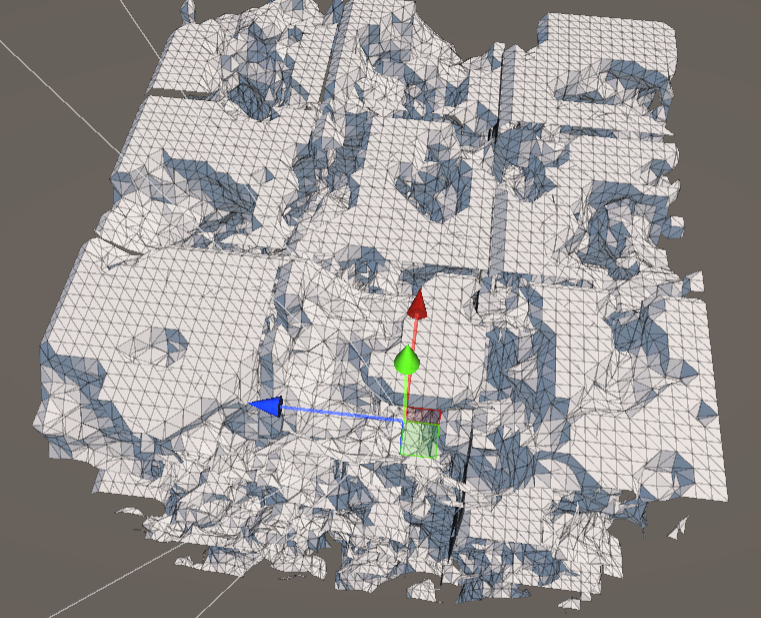
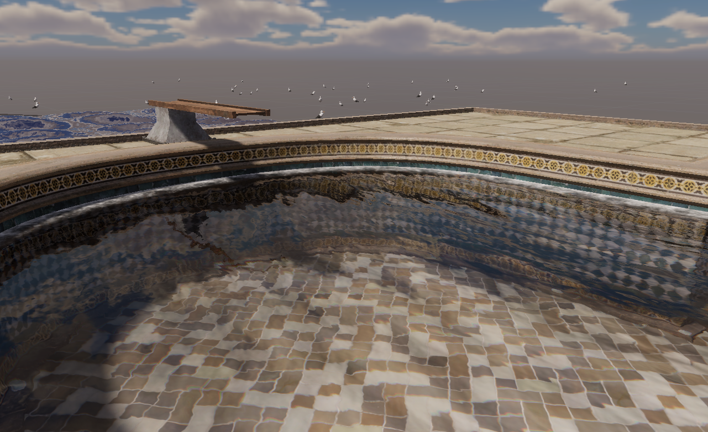
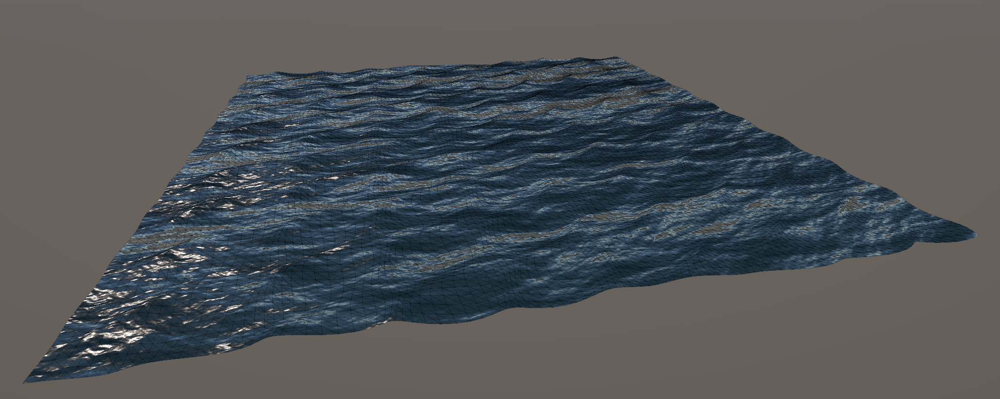

> 這學期開始意識到自己要被 AI 取代了，繼續讀這麼多書有什麼意義呢？

## 作業系統（OS）

- 課號：CSIE3310
- 教授：施吉昇
- 性質：大二必修
- 學分：3
- 等第：A+
- 甜度：🌕🌕🌕🌕🌕 `5.0` / `5.0`
- 涼度：🌕🌕🌕🌕🌑 `4.0` / `5.0`
- 教學：🌕🌕🌕🌕🌑 `4.0` / `5.0`
- 收穫：🌕🌕🌕🌕🌗 `4.5` / `5.0`
- 推薦：🌕🌕🌕🌕🌗 `4.5` / `5.0`
- 課後學習時數：1 小時

簡報很清楚，教授也教的蠻好的，有影片可以看所以我沒去上課，分數也很甜，唯一我對這堂課不滿意的地方就是作業的部份。

作業的品質真的是數一數二差的，spec 沒有寫好還一直亂改，然後去討論區問問題助 教還會亂回答，感覺他自己都不知道作業是怎麼運作的。甚至在作業截止後一個月還可以改作業評分方式，真的是很解。至於 HW3 就不用多說了，~~害怕數學，不喜歡寫程 式~~。

不過 HW2 的內容還蠻有趣的，出作業的助教人也很酷，感覺是個 Arch Linux + Rust 忠實用戶（~~聽起來不像稱讚~~）。

> ~~作業系統沒教 [Arch Linux](https://archlinux.org/) 實在是太可惜了~~

## 機率

- 課號：CSIE3005
- 教授：洪一平
- 性質：大二必修
- 學分：3
- 等第：A
- 甜度：🌕🌕🌕🌕🌑 `4.0` / `5.0`
- 涼度：🌕🌕🌕🌕🌑 `4.0` / `5.0`
- 教學：🌕🌕🌕🌑🌑 `3.0` / `5.0`
- 收穫：🌕🌕🌕🌗🌑 `3.5` / `5.0`
- 推薦：🌕🌕🌕🌗🌑 `3.5` / `5.0`
- 課後學習時數：1 小時

資工系著名的單雙班系統，就是一班很水一班很難，原本機率也是這樣子，林守德客觀的難，洪一平客觀的水，但今年林教授好像有事沒開課，所以直接合併一個大班全部給洪一平。

原本以為會像以往一樣是高中機率水課，結果期中考就炸了我們一波大的，考題不是課本上的爛經典題，而是有變化的有趣題目，其實是我喜歡的考試類型，所以我也只能埋怨自己太不認真（或太笨）。

還好教授大發慈悲，期中 55 期末 62 還把我調到 A，不過有一說一若水獎還蠻好玩的。

> 教授菜菜撈撈

## 人工智慧導論（FAI）

- 課號：JpnL2017
- 教授：陳縕儂、陳尚澤
- 性質：大三必修
- 學分：3
- 等第：A+
- 甜度：🌕🌕🌕🌕🌗 `4.5` / `5.0`
- 涼度：🌕🌕🌕🌕🌕 `5.0` / `5.0`
- 教學：🌕🌕🌕🌑🌑 `3.0` / `5.0`
- 收穫：🌕🌗🌑🌑🌑 `1.5` / `5.0`
- 推薦：🌕🌕🌕🌑🌑 `3.0` / `5.0`
- 課後學習時數：0 小時

課程前半學期內容、簡報、作業完全照搬 [Berkeley CS188](https://www.youtube.com/@berkeley-cs188)，而且大家都一致認為 Berkeley 的教授講得比較好，所以大家都直接去看 Berkeley 的影片或直接看簡報。後半學期則是搬 [HTML](https://www.youtube.com/watch?v=nQvpFSMPhr0&list=PLXVfgk9fNX2I7tB6oIINGBmW50rrmFTqf)，然後我上學期修過 HTML 了，所以這堂課對我來說沒有什麼收穫。

期中考輕輕鬆鬆，我甚至來不及念完，把剩下的投影片直接印在大抄當場讀，題目還是都蠻簡單的，除了最後一題，阿反正出來之後發現根本沒有人會最後一題，我就放心了。期末沒有考試，是 final project，主題是寫一個玩 1v1 德州撲克的 AI（或許應該叫 Agent）。我的策略就是瘋狂 overfit baseline，最後 baseline 的部份 45 分我 拿了 42 分真爽，對戰的部份也不差，拿了 6/10 輕鬆 A+。

整體來說，雖然分數很甜（不排除我在造謠），但我不會太推這堂課，內容跟作業都有點意義不明，不過他是必修ㄏㄏ，慶幸我大二就修掉了。

> 我還蠻會玩德州撲克的

## 計算機圖形

- 課號：CSIE5085
- 教授：歐陽明
- 性質：系上選修
- 學分：3
- 等第：A+
- 甜度：🌕🌕🌕🌕🌕 `5.0` / `5.0`
- 涼度：🌕🌕🌕🌕🌑 `4.0` / `5.0`
- 教學：🌕🌕🌕🌕🌗 `4.5` / `5.0`
- 收穫：🌕🌕🌕🌕🌗 `4.5` / `5.0`
- 推薦：🌕🌕🌕🌕🌕 `5.0` / `5.0`
- 課後學習時數：0 小時

內容基本上就是簡單解析幾何，只要會矩陣運算就輕鬆解決，他基本上是在教你怎麼在電腦上渲染各種形狀（通常是 3D 的），包括模型、光影、材質、貼圖等等，以想像成是 Blender 內部的運作原理。

評分方式是 hw1、期末考、final project 各佔 1/3。而且感覺教授對大學生特別友善，因為這是碩班的課（？。他疑似還有說過如果你是大學生可以加分，還有在作業 Demo 的時候問我是不是大二的。

考試有考古題，而且真的非常簡單，除了最後一兩題算是開放式問題，問你在某個特殊條件下會怎麼設計並加速 ray tracing 的演算法。其他題目都是很簡單的概念題，或 是最多用到解聯立方程的數學而已，期中考輕鬆拿了 96。

Final project 是 1~3 人一組，主題自選。我們原本想做 Marching Cube，後來來不 及了臨時改成 Realistic water simulation，包括水波紋、反射、折射等等，雖然是 用 Unity 隨便拉一拉 shader graph，成品還算不錯（？教授最後給我們 95 分。比較玄的部份是七萬那組做了一個超級神的「考慮廣義相對論的 ray tracer」，但教授給 他們很低分，好像教授看中的主要是原創性，然後那個東西 MIT 有人做過了（但是是 MIT 欸）。

<Grid>
  
  
</Grid>
<Grid> </Grid>

最有趣的部份可能是教授很不會（或懶得）整理資料夾，還有教授的簡報跟個人網站都很有年代感 XD。

> 愛計圖，愛 3D 遊戲設計

## 日文一下

- 課號：JpnL2017
- 教授：村上理奈
- 性質：外語
- 學分：3
- 等第：A
- 甜度：🌕🌕🌕🌗🌑 `3.5` / `5.0`
- 涼度：🌕🌕🌕🌗🌑 `3.5` / `5.0`
- 教學：🌕🌕🌕🌕🌑 `4.0` / `5.0`
- 收穫：🌕🌕🌕🌕🌗 `4.5` / `5.0`
- 推薦：🌕🌕🌕🌕🌑 `4.0` / `5.0`
- 課後學習時數：1.5 小時

這學期剛開學老師就宣佈 A+ 線調整成 93 分，頓感不妙但我還是沒有退選，現在十分後悔。仍然每週都有小考很躁，並且這學期的小考除了單字以外，還有句子翻譯與句子聽力，讓我壓力倍增。

我覺得最主要問題是根本很多人本來就會日文，然後還來日文一炸魚，他們就都輕鬆考，我們還要跟他們競爭 A+ 虧爛ㄌ。btw 我去訪問了修其他日文老師的人，聽起來甜多了，有很多簡單的加分作業，我們只有期末的一個唱歌作業，而且台灣老師比較能理解哪個部份比較難。

> 我真的不會背單字

## 普通天文學

- 課號：Phys4004
- 教授：藍鼎文
- 性質：通識 / 系外選修
- 學分：3
- 等第：停修
- 甜度：🌕🌕🌕🌗🌑 `3.5` / `5.0`
- 涼度：🌕🌕🌕🌕🌑 `4.0` / `5.0`
- 教學：🌕🌕🌕🌕🌗 `4.5` / `5.0`
- 收穫：🌕🌕🌕🌕🌑 `4.0` / `5.0`
- 推薦：🌕🌕🌕🌕🌑 `4.0` / `5.0`
- 課後學習時數：1.5 小時

第一節教授就宣稱這不是一堂水課，並且會有課堂點名（Zuvio 簡單題目），還有 5% 發言分數，一次 +1 分，對我這社恐來說有點小困難。

整體來說確實是可以輕鬆有趣的了解天文學知識，以科普方面來看是非常好的課，唯一的問題是簡報很簡潔，所以只看簡報的話有時候會完全看不懂，一定要現場聽課 ~~但 這該是我自己沒去上課的問題~~，作業也是真的蠻有趣的，可能會是上網看影片寫心得，或是給你一些天文數據分析畫圖。

分數的部份我覺得還算可以，考試其實沒有到那麼難，有好好讀的話就一定大部分會寫，但我期中考只看了幾個小時，炸了一波大的，肯定拿不到 A+ 所以就果斷停修ㄌ，明年應該還會想再修一次（吧）。

> 發現自己對天文的熱忱沒有小時候那麼高了

## 資料結構與演算法（DSA）助教

這學期第一次嘗試當助教，雖然薪水不多，但出作業、認識其他助教、回答同學的問題、與教授開會交流，這些經驗都還蠻有趣且實用的。值得一提的是我不小心把 HW3-4 出的有點難，但 HW4-4 更帥，~~所以我相對友善了一點~~。另外值得二提的是今年的 抄襲狀況特別嚴重，光是我出的題目就抓到了 20 幾個人抄襲，甚至有人就是擺明著故意抄襲，叫 GPT 把變數名稱換掉，但是整個程式碼的架構全部沒有改，連我題目提供 的提示 code 都被換變數名，以為我們眼睛瞎了抓不到，真的是沒看過這麼蠢的人，~~到底怎麼考上台大的~~。有空再回來寫一篇長一點的心得文好了。

## 結語

整體來說期中考可以說是除了 OS 之外其他科目全炸了，真不曉得我上半學期到底在衝殺小，期末考有認真念但還是回天乏術。最後拿了 GPA 4.18 與 $20000 助教薪水，並沒有達到上學期的目標 4.2，而且總學分只有 15 學分，感覺有點危險要延畢了。

下學期準備開始還債，希望可以修滿 25 學分，然後把通識、國文、體育趕緊修一修，大一大二都太混了...不過下學期我預計有培訓班 + 計安 + 計程助教 + 去年停修的線代，GPA 炸定，只求有個 4.1。
