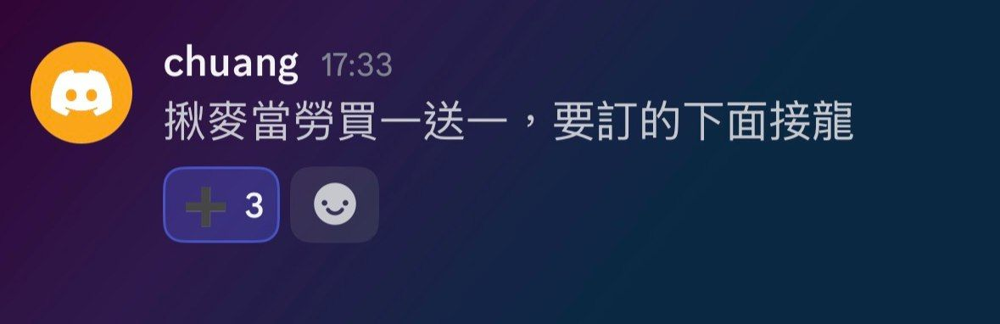
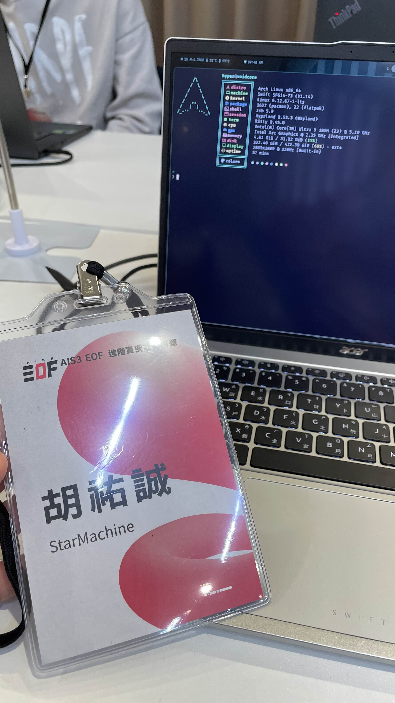
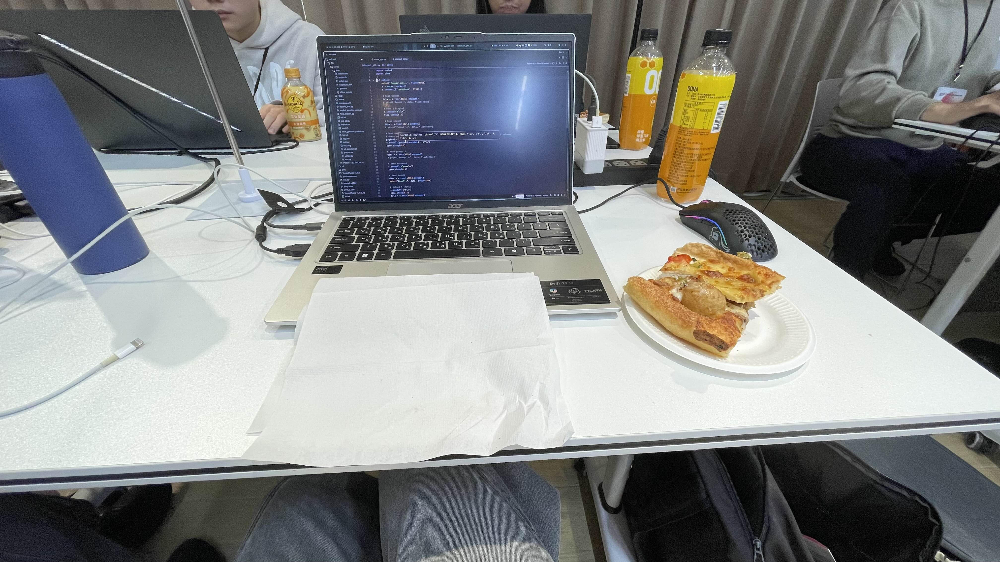
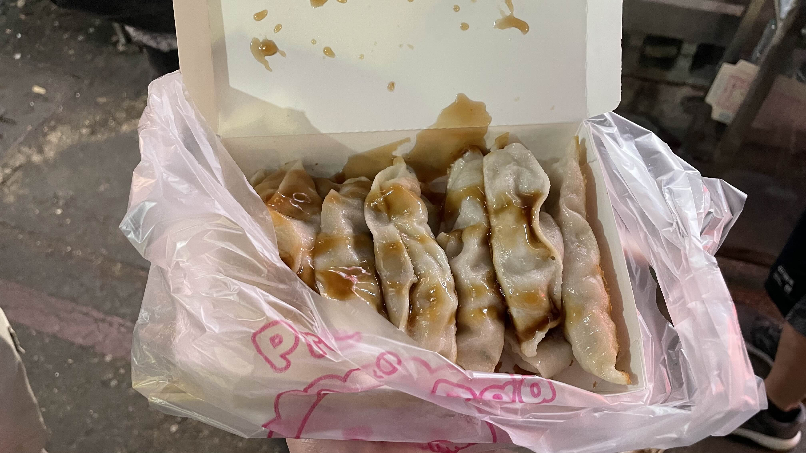
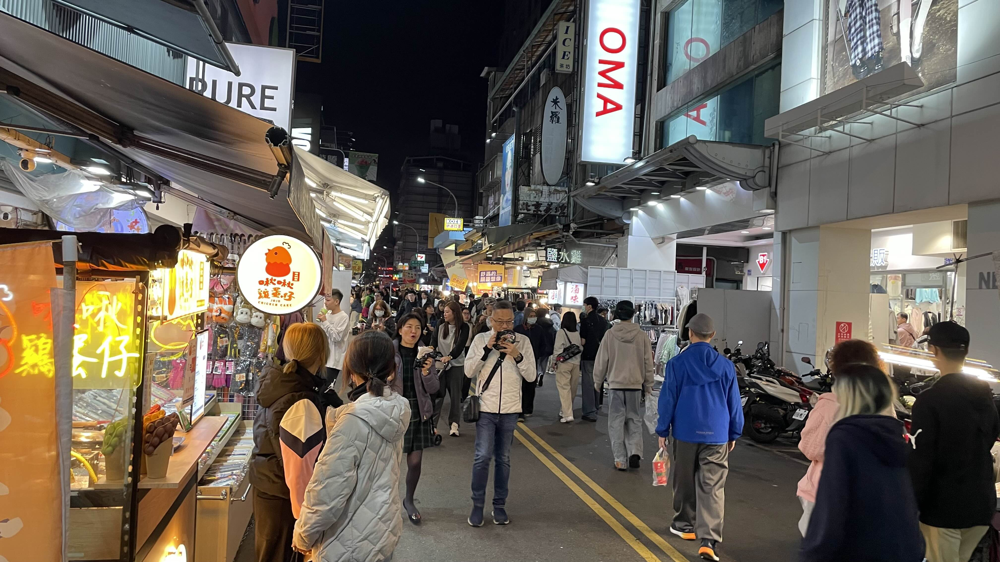
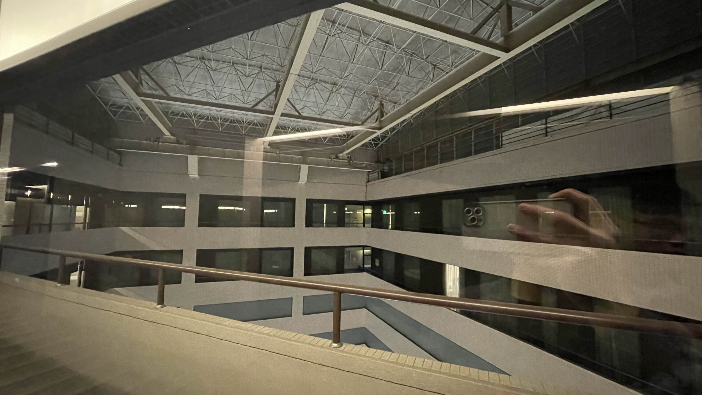
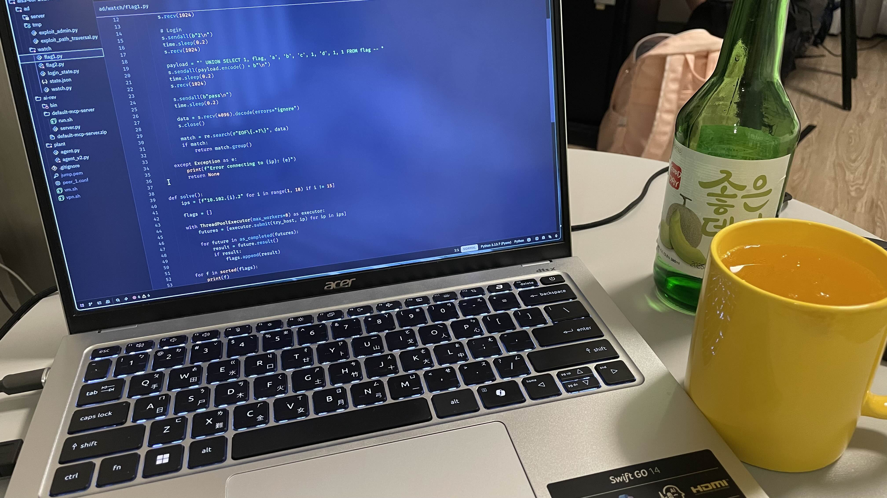
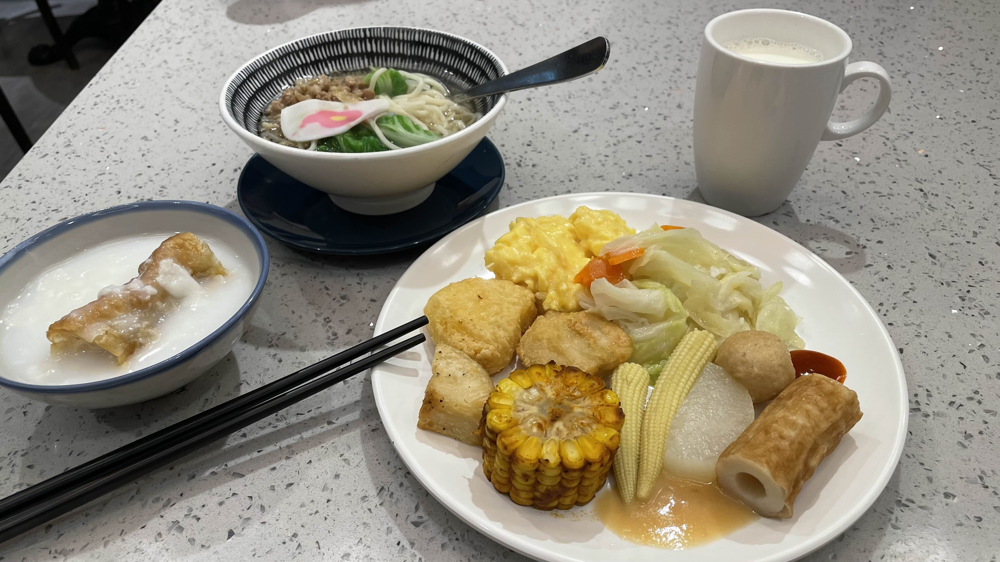
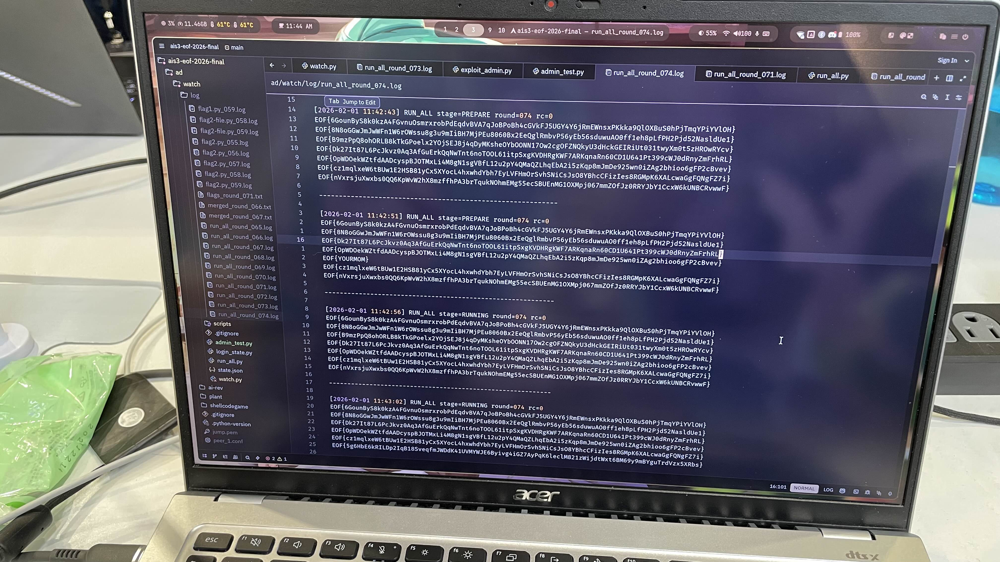
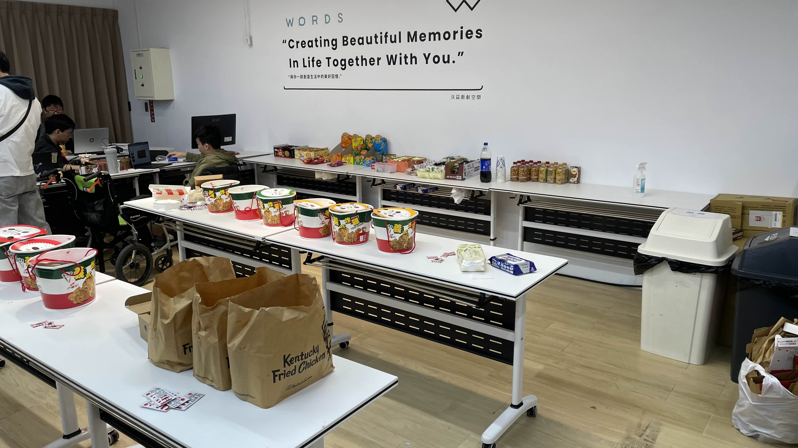

- Team: StarMachine
- Members: hypersoweak, Andromeda, Qwertypig, chenyanjun
- Rank: 14 / 16 (rip)

## Day 0xFF800000

這是我們第一次打資安比賽。如果不是因為當作計算機安全的期末考，大概也不會報名 AIS3 EOF。結果誤打誤撞被撈進決賽，原本只是備取第三，但前面幾組都放棄資格，主辦方還特地打電話來確認我們到底要不要參賽，說如果確定參加就不往下通知了。

嘿對，總之我們成了最後一支晉級決賽的隊伍。現場其他隊伍看起來都好強，打過 N 年 CTF，還有很多是高中生，不過對我們來說只要不墊底就贏了。

StarMachine 取自今年計算機安全 HW1 的題組，一題 Reverse 一題 Pwn，直接把大家炸飛，根本沒幾個人寫出來，大家都還是 IDA 只會按 F5，pwndbg 根本看不懂的狀態。

但很有趣的是，等到期末考前回頭補那兩題時，竟然覺得好簡單。那種真的變強了的感覺非常明顯，這門課帶來的進步感是真的很爽。

題外話，其他隊伍的名字都很奇怪，~~早知道隊名取怪一點~~

## Day 0x0 (Infra)

開賽前一天寄信給 token，有說可以提前架環境、裝工具、準備腳本，但我完全沒打過 A&D 跟 KoH，什麼是 Attack Manager 聽都沒聽過，所以我把 VPN 弄好就跑去玩 GTA5 玩到半夜了，然後就只有睡三小時（

## Day 0x1

一大早就起床跟 Andromeda 從高雄搭高鐵到台中，不得不說比賽真是個強迫調作息的好方法。然後搭計程車去比賽場地，Qwertypig 跟 chenyanjun 已經先到了。

會場有提供無限的免費點心跟飲料

<Grid cols={2}> </Grid>

晚上去晃了一下一中街夜市，

## Day 0x2

## Day 0x7F800000

比較可惜的是賽中太認真看電腦+社恐如我，沒有多認識到這個圈子的人

也算是大開眼界，明年有機會再來玩。
