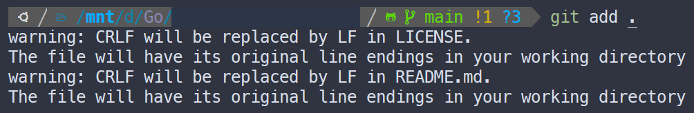

前幾天在使用 `git add` 時跳出如下的錯誤訊息



這是因為 Windows 與 Linux 系統的預設換行字元不同所導致的。Windows 預設的換行字元是 CRLF，Linux 則是 LF，因為換行字元不一樣，提交程式碼的修改內容時，Git 可能會認為每一行都做了修改。

通常發生在多人合作但使用不同作業系統時，也會發生在使用 WSL 時。看檔案是從 Windows 轉 Linux 還是反過來，會是相反的警告訊息：

```
LF will be replaced by CRLF
CRLF will be replaced by LF
```

這其實只需要一行指令就可以解決這個問題（或許）：

```bash
$ git config --global core.autocrlf true
```

可以參考 [Git 官網](https://git-scm.com/book/en/v2/Customizing-Git-Git-Configuration#_formatting_and_whitespace) 給出的詳細說明
