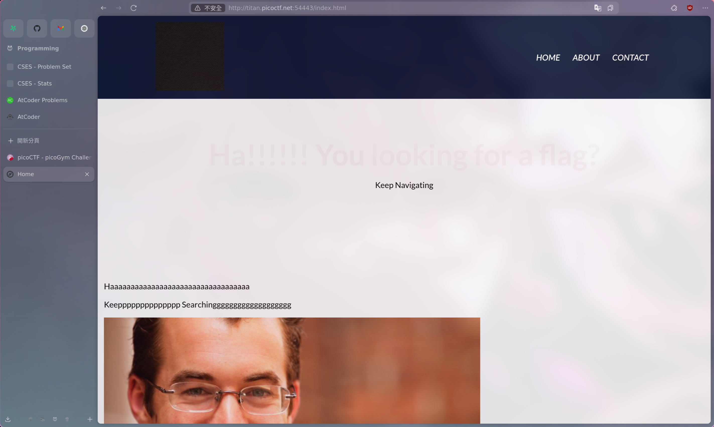
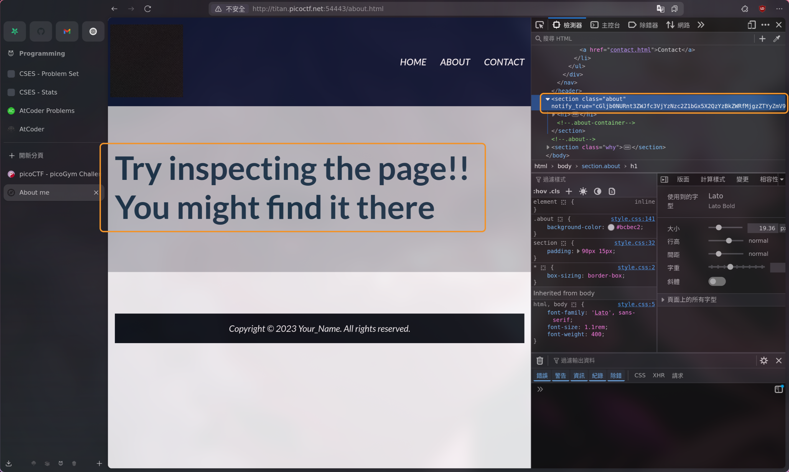
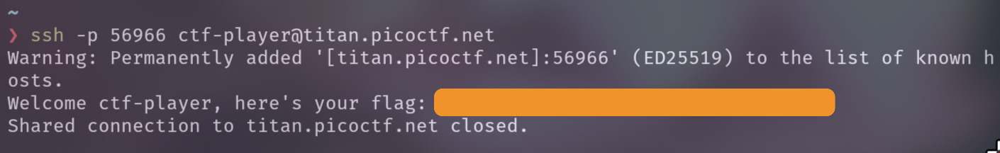
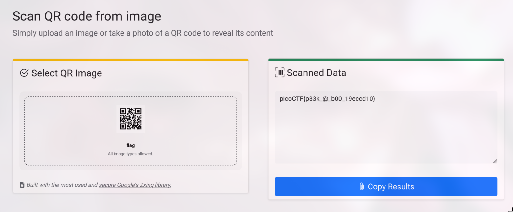
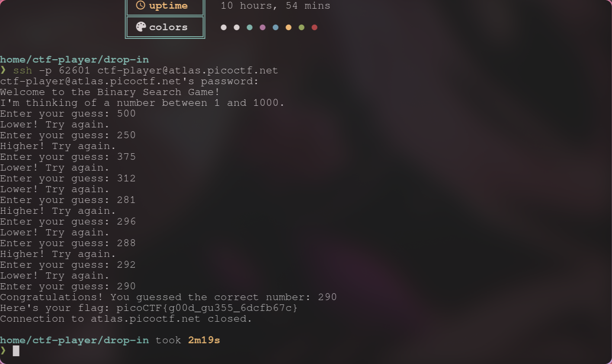
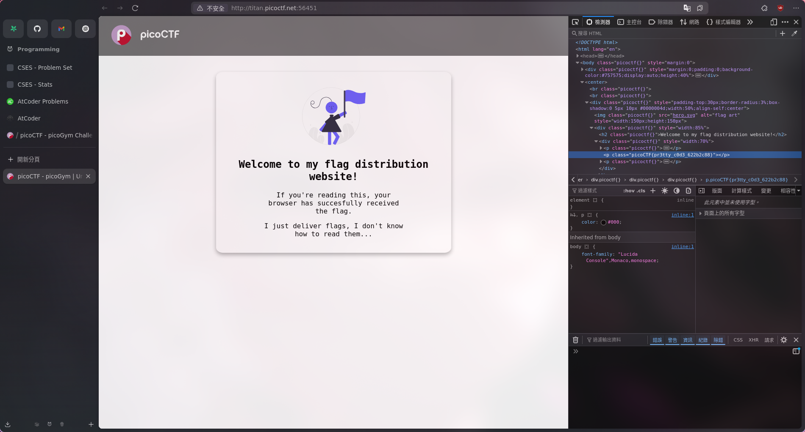

## Easy

### WebDecode

[Problem Link](https://play.picoctf.org/practice/challenge/427?originalEvent=73&page=1)

<Details summary="Solution">

打開之後是個挺抽象的網站



隨便亂翻在 About 頁面 inspect 這坨文字就找到了



`cGljb0NURnt3ZWJfc3VjYzNzc2Z1bGx5X2QzYzBkZWRfMjgzZTYyZmV9` 這東西看起來就像 Base64，解決

> **Flag**: `picoCTF{web_succ3ssfully_d3c0ded_283e62fe}`

</Details>

### Super SSH

[Problem Link](https://play.picoctf.org/practice/challenge/424?originalEvent=73&page=1)

<Details summary="Solution">

我不知道，就 ssh 使用教學（？



> **Flag**: `picoCTF{s3cur3_c0nn3ct10n_8969f7d3}`

</Details>

### Scan Surprise

[Problem Link](https://play.picoctf.org/practice/challenge/444?originalEvent=73&page=1)

<Details summary="Solution">

阿怎麼下載下來 qrcode 掃出來就是 flag，哪招



> **Flag**: `picoctf{p33k_@_b00_19eccd10}`

</Details>

### Binary Search

[Problem Link](https://play.picoctf.org/practice/challenge/442?originalEvent=73&page=1)

<Details summary="Solution">

kitty ssh 貌似有一些破病（？）會亂送 request，所以我換了 alacritty，總之是人腦二分搜。。。



> **Flag**: `picoCTF{g00d_gu355_6dcfb67c}`

</Details>

### Verify

[Problem Link](https://play.picoctf.org/practice/challenge/450?originalEvent=73&page=1)

<Details summary="Solution">

進去之後長這樣

```
ctf-player@pico-chall$ ls
checksum.txt  decrypt.sh  files
```

題目有提供一個 sha256 checksum，files 裡面有一堆檔案，所以直接用

```sh
$ sha256sum files/* | grep 467a10447deb3d4e17634cacc2a68ba6c2bb62a6637dad9145ea673bf0be5e02
```

找到對的檔案然後用他給的 `decrypt.sh` 解密

```sh
ctf-player@pico-chall$ ./decrypt.sh files/c6c8b911
picoCTF{trust_but_verify_c6c8b911}
```

賓果

> **Flag**: `picoCTF{trust_but_verify_c6c8b911}`

</Details>

### heap 0

[Problem Link](https://play.picoctf.org/practice/challenge/438?originalEvent=73&page=1)

<Details summary="Solution">

他給我們可以修改 `0x5cd80e5342b0` 的權限，但他把所謂的 `save_var` bico 放在 pico 後面，所以只要輸入超過 32 bytes 的字串就可以覆蓋掉 bico 的值

```
Heap State:
+-------------+----------------+
[*] Address   ->   Heap Data
+-------------+----------------+
[*]   0x5cd80e5342b0  ->   pico
+-------------+----------------+
[*]   0x5cd80e5342d0  ->   bico
+-------------+----------------+
```

輕鬆拿到 flag

```
1. Print Heap:          (print the current state of the heap)
2. Write to buffer:     (write to your own personal block of data on the heap)
3. Print safe_var:      (I'll even let you look at my variable on the heap, I'm confident it can't be modified)
4. Print Flag:          (Try to print the flag, good luck)
5. Exit

Enter your choice: 2
Data for buffer: hhhhhhhhhhhhhhhhhhhhhhhhhhhhhhhhhhhhhhhhhhhhhhhhhhhhhhhhhhhhhhh

1. Print Heap:          (print the current state of the heap)
2. Write to buffer:     (write to your own personal block of data on the heap)
3. Print safe_var:      (I'll even let you look at my variable on the heap, I'm confident it can't be modified)
4. Print Flag:          (Try to print the flag, good luck)
5. Exit

Enter your choice: 3


Take a look at my variable: safe_var = hhhhhhhhhhhhhhhhhhhhhhhhhhhhhhh


1. Print Heap:          (print the current state of the heap)
2. Write to buffer:     (write to your own personal block of data on the heap)
3. Print safe_var:      (I'll even let you look at my variable on the heap, I'm confident it can't be modified)
4. Print Flag:          (Try to print the flag, good luck)
5. Exit

Enter your choice: 4

YOU WIN
picoCTF{my_first_heap_overflow_0c473fe8}
```

> **Flag**: `picoCTF{my_first_heap_overflow_0c473fe8}`

</Details>

### format string 0

[Problem Link](https://play.picoctf.org/practice/challenge/433?originalEvent=73&page=1)

<Details summary="Solution">

可以看到 source code 第 68 行

```c
        int count = printf(choice1);
```

他直接把 `choice1` 的內容塞進 `printf`，那麼如果 `choice1` 剛好是一個 format string 的話他就會印出後面的東西，所以分別選 `Gr%114d_Cheese` 和 `Cla%sic_Che%s%steak` 他就會很開心的吐後面的 flag 出來

> **Flag**: `picoCTF{7h3_cu570m3r_15_n3v3r_SEGFAULT_63191ce6}`

題外話，1337 食物名稱聽起來很難吃 :(

</Details>

### Unminify

[Problem Link](https://play.picoctf.org/practice/challenge/426?originalEvent=73&page=1)

<Details summary="Solution">

蛤又是簡單的 inspector



> **Flag**: `picoCTF{pr3tty_c0d3_622b2c88}`

</Details>

### Time Machine

[Problem Link](https://play.picoctf.org/practice/challenge/425?originalEvent=73&page=1)

<Details summary="Solution">

```
❯ cat message.txt
This is what I was working on, but I'd need to look at my commit history to know why...
```

他說要看 commit history，好吧

```
❯ git log
commit 89d296ef533525a1378529be66b22d6a2c01e530 (HEAD -> master)
Author: picoCTF <ops@picoctf.com>
Date:   Tue Mar 12 00:07:22 2024 +0000

    picoCTF{t1m3m@ch1n3_186cd7d7}
```

> **Flag**: `picoCTF{t1m3m@ch1n3_186cd7d7}`

</Details>

### Secret of the Polyglot

[Problem Link](https://play.picoctf.org/practice/challenge/423?originalEvent=73&page=1)

<Details summary="Solution">

題目給了一個 `flag2of2-final.pdf`，打開之後裡面是半個 flag：

`1n_pn9_&_pdf_724b1287}`

可以看到 flag 裡面提示 png，用 `file` 偷看他到底是什麼

```
❯ file flag2of2-final.pdf
flag2of2-final.pdf: PNG image data, 50 x 50, 8-bit/color RGBA, non-interlaced
```

他果然是 png，把檔案 rename 成 `.png`，打開就是前半段的 flag 了


btw 其實題目中的 polyglot 就是指一個檔案可以被多種格式解析的意思

> **Flag**: `picoCTF{f1u3n7_1n_pn9_&_pdf_724b1287}`

</Details>

### interencdec

[Problem Link](https://play.picoctf.org/practice/challenge/418?originalEvent=73&page=1)

<Details summary="Solution">

題目給了一個 Base64 編碼的字串

```
❯ echo "YidkM0JxZGtwQlRYdHFhR3g2YUhsZmF6TnFlVGwzWVROclgya3lNRFJvYTJvMmZRPT0nCg==" | base64 -d
b'd3BqdkpBTXtqaGx6aHlfazNqeTl3YTNrX2kyMDRoa2o2fQ=='

~/tmp/ctf
❯ echo "d3BqdkpBTXtqaGx6aHlfazNqeTl3YTNrX2kyMDRoa2o2fQ==" | base64 -d
wpjvJAM{jhlzhy_k3jy9wa3k_i204hkj6}%
```

解完兩層 base64 後的東西顯然是凱薩密碼，隨便丟個線上工具就解出來了

> **Flag**: `picoCTF{caesar_d3cr9pt3d_b204adc6}`

</Details>

### IntroToBurp

[Problem Link](https://play.picoctf.org/practice/challenge/418?originalEvent=73&page=1)

<Details summary="Solution">

題目給了一個 Base64 編碼的字串

```
❯ echo "YidkM0JxZGtwQlRYdHFhR3g2YUhsZmF6TnFlVGwzWVROclgya3lNRFJvYTJvMmZRPT0nCg==" | base64 -d
b'd3BqdkpBTXtqaGx6aHlfazNqeTl3YTNrX2kyMDRoa2o2fQ=='

~/tmp/ctf
❯ echo "d3BqdkpBTXtqaGx6aHlfazNqeTl3YTNrX2kyMDRoa2o2fQ==" | base64 -d
wpjvJAM{jhlzhy_k3jy9wa3k_i204hkj6}%
```

解完兩層 base64 後的東西顯然是凱薩密碼，隨便丟個線上工具就解出來了

> **Flag**: `picoCTF{caesar_d3cr9pt3d_b204adc6}`

</Details>
