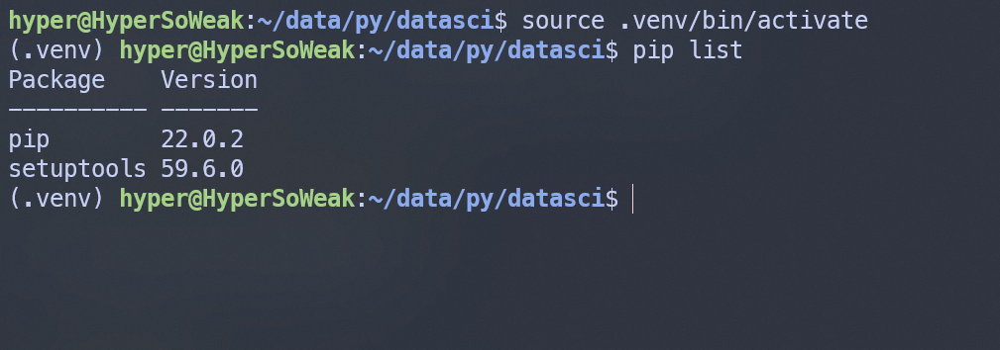

以下操作使用 Ubuntu 22.04.5 LTS。

## 為什麼要使用虛擬環境

虛擬環境（venv）是 Python 開發中的一個重要工具，主要用來隔離專案的執行環境和依賴。當我們同時開發多個專案時，這些專案可能需要不同的 Python 套件或版本。如果直接在全域環境安裝這些套件，容易導致衝突或版本相容問題。虛擬環境允許每個專案擁有獨立的 Python 解譯器和套件，避免專案之間的相互影響。

初學者可能會覺得沒有必要使用虛擬環境，但隨著開發規模的增加，或是手邊有多個 Python 專案同時進行，開發環境之間的隔離就變得相當重要，應當視情況需要使用虛擬環境。

此外，虛擬環境還能讓專案在開發和部署時保持一致，確保生產環境和開發環境的相容性，降低運行時出現問題的風險。

## 建立虛擬環境

建立虛擬環境在 Linux 系統中只需要簡單的一行指令：

```bash
$ python3 -m venv <path-to-new-venv>
```

我通常會將虛擬環境命名為 `.venv`，不過這是個人習慣，沒有硬性規定，所以指令就是：

```bash
$ python3 -m venv .venv
```

這步驟可能會遇到沒有安裝 venv 的情況，直接用 apt 安裝即可。。

```bash
$ sudo apt install python3-venv
```

完成之後在目錄底下就會出現資料夾了。

## 啟用虛擬環境

在每次使用的時候，我們必須先啟用他。使用 `source` 執行 `venv/bin` 底下的 `activate`。

```bash
$ source .venv/bin/activate
```

看到前綴多了 (.venv) 就是成功啟用，接著使用 `pip list` 就可以看到沒有安裝額 外的套件，現在已經是乾淨的環境了。



離開虛擬環境只需要在 shell 中輸入：

```bash
$ deactivate
```

前綴的 (.venv) 消失就代表成功退出了。

## 參考資料

- [官方說明文件](https://docs.python.org/zh-tw/3.13/library/venv.html)
